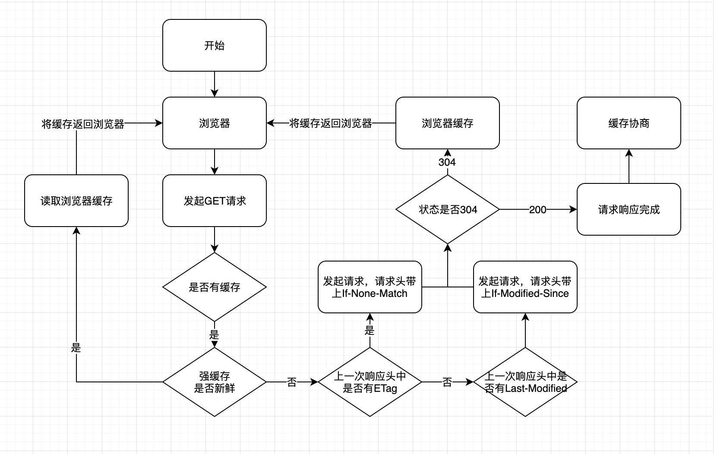

## **HTTP缓存机制**
## 目录
- [前言](#qianyan)
- [强缓存](#qianghc)
- [协商缓存](#xieshanghc)
- [缓存位置](#hcweizhi)
- [用户操作](#operate)

---
### <span id="qianyan">**前言**</span>
&emsp;&emsp;HTTP缓存分为两种，一种是强缓存，另一种是协商缓存。缓存的主要作用是加快资源获取速度，提升用户体验，减少网络传输，缓解服务端压力。具体流程图如下：


- 如果强缓存可用，直接使用
- 否则进入协商缓存，发送HTTP请求，服务器通过请求头中的`If-Modified-Since`或者`If-None-Match`这些条件请求字段检查资源是否更新

    - 若资源更新，返回资源和200状态码
    - 否则返回304，告诉浏览器直接从缓存获取资源
---
### <span id="qianghc">**强缓存**</span>

首先检查的强缓存阶段不需要发送请求，通过相应字段来进行判断。
```
在HTTP/1.0和HTTP/1.1中，使用的字段不相同，1.0时期使用Expires，1.1使用的是Cache-Control
```

1. **Expires**

&emsp;&emsp;Expires的值是一个HTTP日期，及过期时间，时间是相对于服务器的时间而言的，存在于服务端返回的响应头中。当浏览器发起请求时，会根据系统时间和Expires的值进行比较，处在过期时间之前可以直接从缓存里面获取数据，无需再次请求；而系统时间超过Expires的值，缓存将失效。

&emsp;&emsp;**注意**：当系统时间和服务器时间不一致时，比对结果将不准确，因此才会在HTTP/1.1中提出新的字段，而Expires的优先级变得很低（被抛弃）。

2. **Cache-Control**

&emsp;&emsp;Cache-Control是HTTP/1.1中新增的属性。
<br />

- Cache-Control缓存请求指令

|指令|参数(*表示required)|说明|
|---|--|---|
|no-cache|无|强制向源服务器再次验证|
|no-store|无|不缓存请求或响应的任何东西|
|max-age=[秒]|*number|响应的最大age|
|max-stale=([秒])|number|接收已过期的响应|
|min-fresh=[秒]|*number|期望在指定时间内的响应仍有效|
|no-transform|无|代理不可更改媒体类型|
|only-if-cached|无|从缓存获取资源|
<br />

- Cache-Control缓存响应指令

指令|参数(*表示required)|说明
---|--|---
public|无|可向任何一方提供响应的缓存
private|可省略|仅向特定用户返回响应
no-cache|无|强制向源服务器再次验证
no-store|无|不缓存请求或响应的任何内容
no-transform|无|代理不可更改媒体类型
must-revalidate|无|可以缓存但必须再向服务器进行确认
proxy-revalidate|无|要求中间缓存服务器对缓存有效性再进行确认
max-age=[秒]|*number|响应的最大age
s-maxage=[秒]|*number|公共缓存服务器响应最大age
<br />

- **表示是否能缓存的指令**
  -  public
  ```http
    Cache-Control: public
  ```
  表明响应可以被任何对象（包括：发送请求的客户端，代理服务器，等等）缓存，即使是通常不可缓存的内容。（例如：1.该响应没有 `max-age` 指令或 `Expires` 消息头；2. 该响应对应的请求方法是 POST 。）

  - private
  ```http
    Cache-Control: private
  ```
  表明响应只能被单个用户缓存，不能作为共享缓存（即代理服务器不能缓存它）。私有缓存可以缓存响应内容（例如用户本地的浏览器）

  - no-cache
  ```http
    Cache-Control: no-cache
  ```
  使用 `no-cache` 的目的是为了防止从缓存中返回已过期的资源。

  **客户端**发送的请求中如果包含 `no-cache` ，表示客户端不会接收缓存过的响应，要求中间的缓存服务器必须将客户端的请求转发给源服务器，源服务器进行 `ETag` 校验，如果校验通过则从缓存服务器返回资源给客户端。

  **服务器**返回的响应中包含了 `no-cache` ，那么缓存服务器不能对资源进行缓存。源服务器以后也不再对缓存服务器请求中提出对资源有效性进行校验，并且禁止缓存服务器对响应资源进行缓存。

  ```http
    Cache-Control: no-cache=Location
  ```
  只能在响应中指定 `no-cache` 的参数。假如服务器返回的响应中，报文首部字段对 `no-cache` 指定了具体参数，那么客户端在接收这个被指定参数值的首部字段对应的报文后，就不能使用缓存，无参数值的首部字段可以使用缓存

- **控制可执行缓存的对象**
  - no-store
  ```HTTP
    Cache-Control: no-store
  ```
  使用 `no-store` ，表示该请求以及对应的响应中包含机密信息，缓存不应存储有关客户端请求或服务器响应的任何内容，即不使用任何缓存

- **指定缓存期限和认证的指令**
  - max-age
  ```http
    Cache-Control: max-age=3600
  ```

  **客户端**发送的请求包含 `max-age` 时，如果判定缓存资源的时间比 `max-age` 小，客户端就接收缓存资源，否则将请求转发到源服务器。如果指定 `max-age` 为0时，缓存服务器需要将请求转发到源服务器

  **服务器**返回的响应中包含 `max-age` 时，缓存服务器将不再对缓存的资源做有效性判断，`max-age` 代表资源作为缓存的最长时间

  在HTTP1.1中，如果遇到 `Expires` 和 `max-age` 同时存在，会优先处理 `max-age` ，忽略掉 `Expires` ，而HTTP1.0中相反，会处理前者忽略后者

  - s-maxage
  ```http
    Cache-Control: s-maxage=3600
  ```
  `s-maxage` 与 `max-age` 作用相同，不同在它只适用于共享缓存，私有缓存会忽略它

  - min-fresh
  ```HTTP
    Cache-Control: min-fresh=3600
  ```
  `min-fresh` 要求返回缓存时间未超过指定数值的资源

  - max-stale
  ```http
    Cache-Control: max-stale=3600
  ```
  表示接收已过期的缓存。如果未指定数值，则表示无论过期多久的缓存都允许被接收，如果设置了，即使过期，只要处于设定的值之内的资源都可以被接收

- **重新验证和重新加载**
  - must-revalidate
  ```http
    Cache-Control: must-revalidate
  ```
  一旦资源过期（例如超过 `max-age` ），在成功向源服务器验证之前，缓存不能用该资源响应后续请求

  - proxy-revalidate
  ```http
    Cache-Control: proxy-revalidate
  ```
  与 `must-revalidate` 作用相同，但它仅适用于共享缓存（例如代理），并被私有缓存忽略

- **其他**
  - no-transform
  ```http
    Cache-Control: no-transform
  ```
  不得对资源进行转换或转变。 `Content-Encoding、Content-Range、Content-Type` 等 `HTTP` 头不能由代理修改。

3. **Pragma**

&emsp;&emsp;Pragma只有一个值，就是no-cache，效果与Cache-Control中一致，区别在于优先级最高。

---
### <span id="xieshanghc">**协商缓存**</span>

&emsp;&emsp;强缓存失效或不走强缓存后，浏览器在请求头中设置了ETag（If-None-Match)或者Last-Modified（If-Modified-Since）的时候，会将这两个属性值拿到服务端去验证是否命中协商缓存。若命中，会返回304状态码，加载浏览器缓存，并且响应头会设置ETag或Last-Modified属性。

1. **Last-Modified**

- 在浏览器第一次给服务器发送请求后，服务器会在响应头中加上 `Last-Modified` 字段，存放最后修改的时间
- 浏览器接收到后，如果再次请求，会在请求头中携带初次请求响应头中的 `Last-Modified` 时间，放到 `If-Modified-Since` 中
- 服务器拿到请求头中的 `If-Modified-Since` 后，会与服务器中最后一次修改时间进行比对
- 若请求头中值小于最后修改时间，说明需要更新。于是返回新资源，流程与常规HTTP请求无异
- 若相等，返回304并加载浏览器缓存

2. **Etag**

&emsp;&emsp;Etag是服务器根据当前文件内容生成的一串hash码，用于标识该资源。当服务端文件变化时，它的hash码也会随之改变。

&emsp;&emsp;`ETag` 机制同时支持强校验和弱校验，弱校验只有服务器上的文件差异达到能够触发 `hash` 值后缀变化的时候，才会真正请求资源。使用的强还是弱验证，通过 `ETag` 标识符的开头是否存在 `W/`（weak） 来区分，例如：
```
"123456789" ——强 ETag 验证
W/"123456789" ——弱 ETag 验证
```
- 服务器通过响应头把这个值给浏览器
- 浏览器接收到后，如果再次请求，会把这个值作为If-None-Match这个字段的内容放到请求头中，发给服务器
- 服务器接收该值后与资源的ETag进行比对
- 若不同，说明需要更新，返回新资源
- 相同返回304，直接使用浏览器缓存

3. **对比**

&emsp;&emsp;精准度上而言，ETag比Last-Modified要好。一是因为编辑资源内容可能没有更改，这样会造成缓存失效；二是Last-Modified的感知单位时间是秒，若一秒内多次改变则无法体现出修改。

&emsp;&emsp;性能上Last-Modified更好，因为只是一个时间节点，不需要根据文件内容生成hash码。

&emsp;&emsp;服务器有限考虑ETag。

---
### <span id="hcweizhi">**缓存位置**</span>

&emsp;&emsp;浏览器中缓存位置一共有四种，按照优先级从高到低排序如下：
- Service Worker
- Memory Cache
- Disk Cache
- Push Cache

---
### <span id="operate">**用户操作**</span>


用户操作 | Expires / Cache-Control | Last-Modified / ETag
---|---|---
地址栏回车 | 有效 | 有效
页面链接跳转 | 有效 | 有效
新开窗口 | 有效 | 有效
前进后退 | 有效 | 有效
cmd + R | 无效 | 有效
cmd + shift + R | 无效 | 有效

* 普通刷新<br>
    cmd + R普通刷新时，绕过浏览器本地缓存，服务器端的协商缓存生效。
* 强制刷新<br>
    cmd + shift + R强制刷新时，绕过所有缓存，直接让服务器返回最新的资源。
* 回车或转向<br>
    在地址栏输入地址或跳转等操作时，所有缓存都生效。
