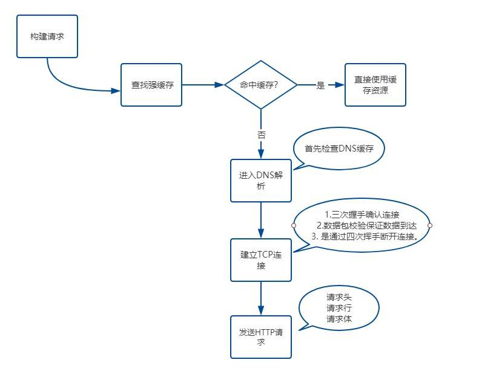
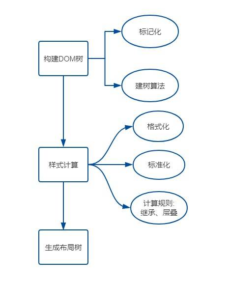
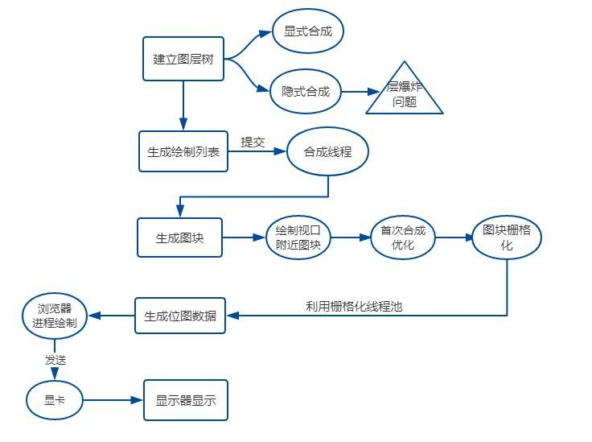

[参考地址](https://juejin.cn/post/6844904021308735502)

## 目录
- [题外话——浏览器简介](#browser)
- [简单流程](#above)
- [输入URL到渲染的过程——网络过程](#network)
- [输入URL到渲染的过程——解析过程](#analyse)
- [输入URL到渲染的过程——渲染过程](#render)
---
## <span id="browser">**题外话-浏览器简介**</span>

&emsp;&emsp;浏览器主要组成部分如下：

- **用户界面**：包括地址栏、前进/后退按钮、书签菜单等。除了浏览器主窗口显示的您请求的页面外，其他显示的各个部分都属于用户界面；
- **浏览器引擎**：在用户界面和呈现引擎之间传送指令；
- **呈现引擎**：负责显示请求的内容。如果请求的内容是 HTML，它就负责解析 HTML 和 CSS 内容，并将解析后的内容显示在屏幕上；
- **网络**：用于网络调用，比如 HTTP 请求。其接口与平台无关，并为所有平台提供底层实现；
- **用户界面后端**：用于绘制基本的窗口小部件，比如组合框和窗口。其公开了与平台无关的通用接口，而在底层使用操作系统的用户界面方法；
- **JavaScript解释器**：用于解析和执行 JavaScript 代码；
- **数据存储**：这是持久层。浏览器需要在硬盘上保存各种数据，例如 Cookie。新的 HTML 规范 (HTML5) 定义了“网络数据库”，这是一个完整（但是轻便）的浏览器内数据库。


---
## <span id="above">**简单流程**</span>

&emsp;&emsp;先给出一个简单的流程，后面有更加详细的描述内容：

### **网络部分**
1. 构建请求行
2. 查找强缓存，有则使用无则下一步
3. `DNS`(Domain Name System)查找，查找过程：浏览器自身的DNS缓存-> OS自身DNS缓存-> 读取host文件->本地域服务器->权限域名服务器->根域名服务器
4. 建立 TCP 连接
    1. 三次握手
    2. 四次挥手
5. 服务端返回数据
    1. 是否断开TCP连接要看Connection字段是否为Keep-Alive

### **解析部分**

6. 构建DOM树
    1. 标记化算法
    2. 建树算法
7. 样式计算
    1. 格式化样式表
    2. 标准化样式表
    3. 计算每个点的具体位置
8. 生成布局树 Layuot Tree
    1. 遍历DOM树节点
    2. 计算布局树节点的坐标位置

### **渲染部分**

9. 生成图层树 Layer Tree
10. 生成绘制列表
11. 生成图块并栅格化
12. 显示器显示内容

---
## <span id="network">**输入URL到渲染的过程——网络过程**</span>

### **网络请求的部分**

#### **1、构建请求**

&emsp;&emsp;浏览器构建请求行
```
//  请求方式为GET，路径为根路径，HTTP协议版本为1.1
GET / HTTP/1.1
```

#### **2、查找强缓存**

&emsp;&emsp;先检查强缓存，如果命中直接使用，不中则进入下一步。**注意：强缓存不需要发送HTTP请求，因此这里就可以进行判定。**

#### **3、DNS解析**

&emsp;&emsp;一般都是输入`域名`，而数据包是通过`IP地址`传给对方，因此需要得到`域名`对应的`IP地址`。**DNS系统**将域名和IP一一映射，得到具体的IP的过程就是DNS解析。

&emsp;&emsp;浏览器提供了**DNS数据缓存功能**，当一个域名解析过，就将解析结果缓存下来，下次可直接使用。

&emsp;&emsp;如果不指定端口，默认采用对应IP的80端口。

#### **4、建立TCP连接**

&emsp;&emsp;Chrome在同一域名下要求同时最多只能由6个TCP连接，超过6个后剩下的将需要等待。

&emsp;&emsp;不需要等待的将建立TCP连接，分为如下三个阶段：
- 通过**三次握手**建立客户端和服务器之间的连接；
- 进行数据传输。接收方接收到数据包后必须要向发送方`确认`，发送方未收到`确认`会判定为数据包丢失，于是重新传输。传输过程可以将大数据包拆成一个个小包，接收方按照顺序再组装；
- 通过**四次挥手**来断开连接。

#### **5、发送HTTP请求**

&emsp;&emsp;当TCP连接建立后，浏览器开始和服务器通信，开始发送HTTP请求。**发送的HTTP请求有三个部分：请求行、请求头和请求体。**

&emsp;&emsp;**请求行**可以参看第一步，由**请求方法、请求URL和HTTP版本组成**；

&emsp;&emsp;**请求头**包含了如下示例属性：
```
Accept: text/html,application/xhtml+xml,application/xml;q=0.9,image/webp,image/apng,*/*;q=0.8,application/signed-exchange;v=b3
Accept-Encoding: gzip, deflate, br
Accept-Language: zh-CN,zh;q=0.9
Cache-Control: no-cache
Connection: keep-alive
Cookie: /* 省略cookie信息 */
Host: www.baidu.com
Pragma: no-cache
Upgrade-Insecure-Requests: 1
User-Agent: Mozilla/5.0 (iPhone; CPU iPhone OS 11_0 like Mac OS X) AppleWebKit/604.1.38 (KHTML, like Gecko) Version/11.0 Mobile/15A372 Safari/604.1
```

&emsp;&emsp;**请求体**只有在POST请求中才会有。

### **网络响应**

&emsp;&emsp;HTTP请求发送到服务器，服务器经过相应处理后要把数据返回给浏览器。**网络响应有三个部分：响应行、响应头和响应体。**

&emsp;&emsp;响应行示例如下，由HTTP协议版本、状态码和状态描述组成：
```
HTTP/1.1 200 OK
```

&emsp;&emsp;响应头包含了服务器及其返回数据的一些信息，服务器生成数据时间、返回的数据类型以及即将写入Cookie的信息。示例如下：
```
Cache-Control: no-cache
Connection: keep-alive
Content-Encoding: gzip
Content-Type: text/html;charset=utf-8
Date: Wed, 04 Dec 2019 12:29:13 GMT
Server: apache
Set-Cookie: rsv_i=f9a0SIItKqzv7kqgAAgphbGyRts3RwTg%2FLyU3Y5Eh5LwyfOOrAsvdezbay0QqkDqFZ0DfQXby4wXKT8Au8O7ZT9UuMsBq2k; path=/; domain=.baidu.com
```
&emsp;&emsp;响应完成后，要判断`Connection`字段，假如请求头或者响应头中包含**Connection: Keep-Alive**，表示建立持久连接，TCP连接将一直保持，之后请求同一站点的资源会复用该连接；否则断开TCP连接，结束请求——响应的流程。

### **总结**



---
## <span id="analyse">**输入URL到渲染的过程——解析过程**</span>

&emsp;&emsp;完成网络请求和响应，如果响应头中`Content-Type`的值是`text/heml`，那么之后就是浏览器的解析和渲染工作。

&emsp;&emsp;首先看看解析部分，主要有如下步骤：
- 一、构建DOM树；
- 二、样式计算；
- 三、生成布局树（Layout Tree）

### **一、构建DOM树**

&emsp;&emsp;浏览器无法直接理解HTML字符串，因此将其转换为方便操作的数据结构，即DOM树。DOM树本质上是一个以documnet为根节点的多叉树。

### **二、样式计算**

&emsp;&emsp;CSS样式，其来源一般是三种：
1. link标签引用
2. style标签中的样式
3. 元素内嵌的style属性

#### **格式化样式表**
&emsp;&emsp;浏览器是无法直接识别 CSS 样式文本的，因此渲染引擎接收到 CSS 文本后第一件事情是将其转化为一个结构化的对象，即 styleSheets；

#### **标准化样式属性**
&emsp;&emsp;有一些 CSS 样式并不容易被渲染引擎所理解，因此需要在计算样式前将它们标准化，如 `em` -> `px` `red` -> `#ff0000` `bold` -> `700` 等。

#### **计算每个节点的具体样式**
&emsp;&emsp;主要规则有两个，**继承**和**层叠**。

&emsp;&emsp;每个子节点会默认继承父节点的样式属性，如果父节点中没找到，就会采用浏览器默认样式，也叫 `UserAgent样式`。这就是继承。

&emsp;&emsp;最终的样式取决于各个属性共同作用的效果，（暂不展开讲层叠）

&emsp;&emsp;计算完样式后，所有样式都被挂载到 `window.getComputedStyle` 当中，可以通过 `JavaScript` 来获取计算后的样式。

### **三、生成布局树**

&emsp;&emsp;布局树生成的大致工作如下：
1. 遍历生成的 DOM 树节点，并把它们添加到布局树中
2. 计算布局树节点的坐标位置

&emsp;&emsp;**注意：**布局树仅包含可见元素，对于 `head` 标签和设置了 `display: none` 的元素，将不会放入其中；现在Chrome在重构后已经没有生成 `Render Tree` 的过程了。

### **总结**


---
## <span id="render">**输入URL到渲染的过程——渲染过程**</span>

&emsp;&emsp;渲染的过程主要分为如下步骤：
- 一、建立图层树（Layer Tree）
- 二、生成绘制列表
- 三、生成图块并栅格化
- 四、显示器显示内容

### **一、建图层树**

&emsp;&emsp;在绘制页面前还需要考虑一些复杂场景，比如 3D 动画如何呈现变换效果、元素含有层叠上下文时如何控制显示和隐藏等等。

&emsp;&emsp;为了解决上述问题，浏览器在构建完布局树后，还会对特定的节点进行分层，构建一棵**图层树（layout tree）**。

&emsp;&emsp;一般情况下，节点的图层会默认属于父节点的图层（也叫合成层），而有两种情况会提升为一个单独的合成层，一种显式一种隐式。

**显式合成**
1. 拥有层叠上下文的节点

&emsp;&emsp;拥有层叠上下文的节点一般如下：
- HTML根元素自身拥有层叠上下文
- 普通元素设置 `position` 不是 `static`，且有 `z-index` 属性
- 元素的 `opacity` 不是1
- 元素的 `transform` 不是 `none`
- 元素的 `filter` 不是 `none`
- 元素的 `isolation` 是 `isolate`
- `will-change` 指定的属性为上面任意一个

2. 需要剪裁的地方

&emsp;&emsp;例如一个 div，只设置了 100*100 像素，而里面有非常多文字，超出部分需要剪裁。如果出现了滚动条，滚动条会被单独提升为一个图层。

**隐式合成**

&emsp;&emsp;简单来说就是 `层叠等级低` 的节点被提升为单独的图层后，所有层叠等级比它高的节点都会成为一个单独的图层。

<font color="red">**注意：当需要重绘时，只需要重绘本身，而不会影响到其他层**</font>

### **二、生成绘制列表**

&emsp;&emsp;渲染引擎会将图层的绘制拆分成一个个绘制指令，例如先画背景，再画边框，然后将这些指令按顺序组合成一个待绘制的列表。

### **三、生成图块并栅格化**

&emsp;&emsp;现在才开始绘制操作。

&emsp;&emsp;在渲染进程中绘制操作是由专门的线程来完成，这个线程叫**合成线程**。绘制列表准备好后，渲染进程的主线程会给合成线程发送 `commit` 消息，把绘制列表提交给合成线程。

&emsp;&emsp;为了应对页面过大，而窗口过小，一口气全部绘制浪费性能的问题，合成线程会将图层分块，分块不会很大，通常 256* 256 或者 512* 512规格。

&emsp;&emsp;图块数据进入 GPU 内存，考虑到浏览器内存上传到 GPU 内存操作较慢，即使小图块也会耗费大量时间，因此Chrome采用如下策略：首次合成图块时只采用一个低分辨率的图片，然后继续进行合成操作，当正常的图块内容完成绘制后再替换掉低分辨率图块，达成优化首屏加速的目的。

&emsp;&emsp;顺便，渲染进程中专门维护了一个**栅格化线程池**，专门负责把图块转换为**位图数据**，然后合成线程会选择视口附近的图块，把它交给栅格化线程池生成位图。生成位图过程中实际会使用 GPU 进行加速，生成的位图最终发送给合成线程。

### **四、显示器显示内容**

**补充：显示器显示图像原理**
```
屏幕都有一个固定的刷新频率，一般是60赫兹，即60帧，一秒更新60张图片

每次更新的图片都来自显卡的前缓冲区。
而显卡接收到浏览器进程传进来的页面后，会合成相应的图像，并将图像保存到后缓冲区
然后系统自动将前缓冲区和后缓冲区对换，如此循环更新
```


&emsp;&emsp;栅格化操作完成后，合成线程会生成一个绘制命令，即“DrawQuad”，发送给浏览器进程。浏览器进程中的 `viz`组件 接收到命令，把页面内容绘制到内存，即生成页面，然后把这部分内存发送给显卡。

### **总结**

