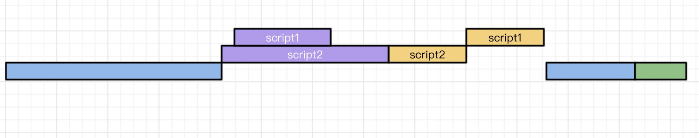

## **性能优化**

### **回流与重绘**

见[回流与重绘](./6、回流与重绘.md)

---
### **为什么JavaScript是单线程设计**

&emsp;&emsp;`JavaScript` 的作用是处理页面交互、操作 `DOM` 树、`CSS` 树、与服务器逻辑交互等。

&emsp;&emsp;如果 `JavaScript` 是多线程来处理这些逻辑，可能会出现 `UI` 操作的冲突，处于 `UI` 中的 `DOM` 节点就可能变成临界资源（？不太懂）

&emsp;&emsp;例如多个线程同时操作一个 `DOM`，一个修改一个删除，此时浏览器需要判断哪个线程的操作生效，虽然可以引入锁等机制来解决上述问题，但为了避免复杂度，最终 `JavaScript` 选择了单线程执行的策略。

---
### **script标签的 defer 和 async**

- 普通 script 标签

文档解析过程中遇到 script 标签会停止页面的解析，而对 script 资源下载并执行；遇到多个 script 标签会按照开始下载的顺序执行，下载完却未轮到执行的脚本会暂时挂起。当脚本执行完成后才继续文档的解析渲染过程。

- defer script 标签

文档解析过程中遇到带有 defer 的 script 标签，就会直接开始在后台进行下载，但不会阻塞文档的渲染立即开始执行脚本，而是当页面解析和渲染完毕后，会等到所有的 defer 脚本全部加载完毕并按照顺序执行，执行完毕后触发 DOMContentLoaded 事件。

- async script 标签

文档解析过程中遇到带有 async 的 script 标签，也会立即开始下载，并在下载完成后立即执行脚本。带有 async 的 script 标签的加载不会计入 DOMContentLoaded 事件统计，所以下图两种情况都可能发生。**async 脚本的执行顺序与加载顺序无关，先下载完毕的先执行**。

.png)

**适用场景**：

defer：脚本依赖于页面中的 DOM（文档是否解析完毕），或者被其他脚本依赖

async：脚本并不依赖 DOM 元素，且不被其他脚本依赖

---
### **JavaScript为什么会阻塞页面加载**

&emsp;&emsp;因为 `JavaScript` 能够操作 `DOM`，如果修改元素属性的同时进行渲染（即 `JavaScript` 线程和 `UI` 线程同时运行），那么渲染线程先后得到的元素数据可能会不一致。

&emsp;&emsp;为了防止渲染出现不可预期的结果，浏览器设置**GUI渲染线程与 JavaScript 引擎为互斥关系。**

&emsp;&emsp;当 `JavaScript` 引擎执行时，`GUI` 线程会被挂起，更新被保存到一个队列中，等到 `JavaScript` 引擎空闲时才立即执行。因此如果 `JavaScript` 引擎执行时间过长，就会阻塞页面渲染加载，导致页面渲染不连贯等问题。

---
### **CSS加载会造成阻塞吗**

&emsp;&emsp;`DOM` 和 `CSSOM` 通常是并行构建的（？不同内核浏览器会一样吗），所以**CSS不会阻塞 DOM 的解析。**

&emsp;&emsp;由于 `Render Tree` 是依赖于 `DOM Tree` 和 `CSSOM Tree`，所以它必须等到 `CSSOM Tree` 构建完成后，也就是 `CSS` 资源加载完成（或失败）后，才能开始渲染，因此**CSS会阻塞DOM的渲染。**

&emsp;&emsp;由于 `JavaScript` 可以操作 `DOM` 和 `CSS`，所以要等到 `CSS` 加载完成后才会运行后面的 `JavaScript` 代码，因此**CSS会阻塞后面JavaScript的运行**

