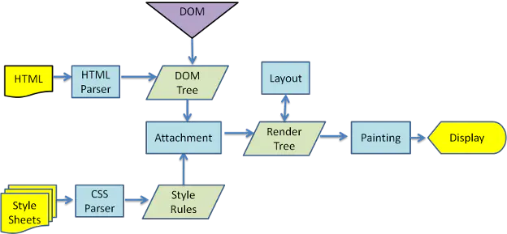
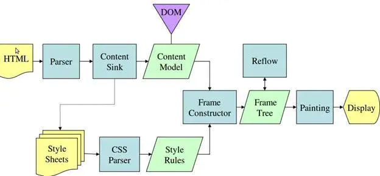

## **浏览器工作原理**

[一篇好文地址](https://www.html5rocks.com/zh/tutorials/internals/howbrowserswork/)

## **目录**
- [浏览器主要结构](#main-components)
- [呈现引擎](#rendering-engine)
- 
- 

---
### **浏览器主要结构**

&emsp;&emsp;浏览器主要组成部分如下：

- **用户界面**：包括地址栏、前进/后退按钮、书签菜单等。除了浏览器主窗口显示的您请求的页面外，其他显示的各个部分都属于用户界面；
- **浏览器引擎**：在用户界面和呈现引擎之间传送指令；
- **呈现引擎**：负责显示请求的内容。如果请求的内容是 HTML，它就负责解析 HTML 和 CSS 内容，并将解析后的内容显示在屏幕上；
- **网络**：用于网络调用，比如 HTTP 请求。其接口与平台无关，并为所有平台提供底层实现；
- **用户界面后端**：用于绘制基本的窗口小部件，比如组合框和窗口。其公开了与平台无关的通用接口，而在底层使用操作系统的用户界面方法；
- **JavaScript解释器**：用于解析和执行 JavaScript 代码；
- **数据存储**：这是持久层。浏览器需要在硬盘上保存各种数据，例如 Cookie。新的 HTML 规范 (HTML5) 定义了“网络数据库”，这是一个完整（但是轻便）的浏览器内数据库。

---

### **呈现引擎**

&emsp;&emsp;注：和大多数浏览器不同，Chrome浏览器的每个标签页都分别对应一个呈现引擎实例，每个标签页都是一个独立的进程

Webkit内核的渲染主流程：

Geoko内核的渲染主流程：

对比来看主要在css的解析环节有区别
