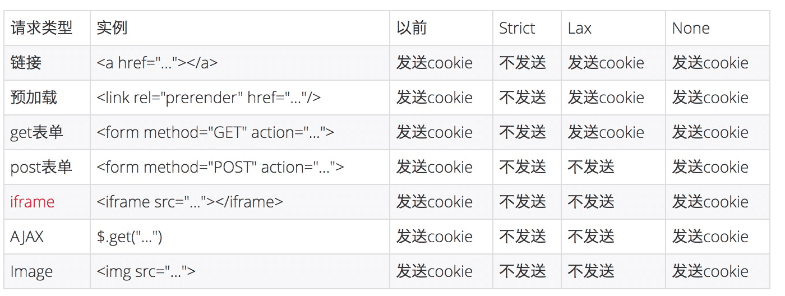

# **Cookie和SameSite**

## **目录**

- [HTTP](#http)
- [Cookie](#cookie)
    - [Name/Value](#name)
    - [Expires](#expires)
    - [Max-Age](#max-age)
    - [Domain](#domain)
    - [Path](#path)
    - [Secure](#secure)
    - [HTTPOnly](#httponly)
    - [Same Site](#samesite)
- [跨站和跨域](#kuazhan)
- [解决方案](#solution)
- [参考](#copy)

---
## <span id="http">**HTTP**</span>

&emsp;&emsp;一般说“ `HTTP` 是一个无状态的协议”（这里的 `HTTP` 是指 `HTTP` 1.x 版本的），所谓无状态，可以简单理解为**同一个客户端连续两次发送请求给服务器，服务器也识别不出这是同一个客户端发送的请求**。这导致了例如：添加一个商品到购物车中，但因为识别不出是同一个客户端，刷新页面后就没了。

---
## <span id="cookie">**Cookie**</span>

&emsp;&emsp;为了解决 `HTTP` 无状态的问题，于是出现了 `Cookie`。关于 `Cookie` 的基本内容可以看[这里](./3、浏览器的本地存储.md)

&emsp;&emsp;`Cookie` 是如何设置的？
1. 客户端发送 `HTTP` 请求到服务器
2. 当服务器收到 `HTTP` 请求后，在响应头里面添加 `Set-Cookie` 字段
3. 浏览器收到响应后保存下 `Cookie`
4. 之后对该服务器每一次请求中都通过 `Cookie` 字段将其信息发送给服务器

### **Cookie的属性**

先看图


<span id="name">**Name/Value**</span>

&emsp;&emsp;用 `JavaScript` 操作 `Cookie` 的时候注意对 `Value` 进行编码处理

<span id="expires">**Expires**</span>

&emsp;&emsp;`Expires` 用于设置 `Cookie` 的过期时间。

&emsp;&emsp;当 `Expires` 属性缺省时，表示是会话性 `Cookie`，当是会话性 `Cookie` 的时候，其值保存在客户端内存中，并在用户关闭浏览器时失效。而有些浏览器提供了会话恢复功能，这种情况下即使关闭了浏览器，会话期的 `Cookie` 也会被保留下来，好像浏览器没有关闭过一样。

&emsp;&emsp;持久性 `Cookie` 会保存在用户的硬盘中，直至过期或者被清除。<font color="red">**注意：设定的日期和时间只与客户端相关，而不是服务端**</font>

<span id="max-age">**Max-Age**</span>

&emsp;&emsp;顾名思义是 `Cookie` 失效前经过的秒数，可以为正数、负数，甚至是0；如果是**正数，浏览器会将其持久化**，如果是**负数，表示它只是一个会话性 `Cookie`**，如果是**0，则立即删除这个 `Cookie`**。当 `Expires` 和 `Max-Age` 都存在时，后者的优先级更高。

<span id="domain">**Domain**</span>

&emsp;&emsp;`Domain` 制定了 `Cookie` 可以送达的主机名。假如没有指定，那么默认值为当前文档访问地址中的主机部分（但不包括子域名）

&emsp;&emsp;例如淘宝首页设置的 `Domain` 就是 `.taobao.com`，所以无论是 `a.taobao.com` 还是 `b.taobao.com` 都可以使用。

&emsp;&emsp;但需要注意，不能够跨域设置 `Cookie`，例如阿里域名下的页面把 `Domain` 设置为百度就是无效的。
```http
Set-Cookie: qwerty=219ffwef9w0f; Domain=baidu.com; Path=/; Expires=Wed; 30 Aug 2020 00:00:00 GMT
```

<span id="path">**Path**</span>

&emsp;&emsp;`Path` 指定了一个 `URL` 路径，这个路径必须出现在要请求的资源的路径中才可以发送 `Cookie` 首部。

&emsp;&emsp;比如设置 `Path=/docs`，`/docs/Web/` 下的资源会带 `Cookie` 首部，那么 `/test` 就不会携带 `Cookie` 首部。

&emsp;&emsp;`Domain` 和 `Path` 共同定义了 `Cookie` 的作用域，即它应该发送给哪些 `URL`。

<span id="secure">**Secure**</span>

&emsp;&emsp;标记为 `Secure` 的 `Cookie` 只能通过被 `HTTPS` 协议加密过的请求发送给服务器。使用 `HTTPS` 安全协议，可以保护 `Cookie` 在浏览器和 `Web` 服务器间的传输过程不被窃取和篡改。

<span id="httponly">**HTTPOnly**</span>

&emsp;&emsp;设置了该属性可以防止客户端脚本通过 `document.cookie` 等方式来访问 `Cookie`，有助于避免 `XSS` 攻击。

<span id="samesite">**SameSite**</span>

&emsp;&emsp;该属性可以让 `Cookie` 在跨站请求时不会被发送，从而可以组织跨站请求伪造攻击（CSRF）。

它的属性值有三个：
1. **Strict** 最为严格，完全禁止第三方 `Cookie`，跨站点时任何情况下都不会发送 `Cookie`。仅允许一方请求携带 `Cookie`，即浏览器将只发送相同站点请求的 `Cookie`，即当前网页 `URL` 与请求目标 `URL` 完全一致。
```http
Set-Cookie: CookieName=CookieValue; SameSite=Strict;
```
2. **Lax** 允许部分第三方请求携带 `Cookie`。设置了 `Strict` 或 `Lax` 以后，基本就杜绝了 `CSRF` 攻击，前提是用户浏览器支持 `SameSite` 属性。
```http
Set-Cookie: CookieName=CookieValue; SameSite=Lax;
```
具体如下：
|请求类型|示例|正常情况|Lax
|----|------|---|---|
|链接|`<a href="..."></a>`|发送|发送|
|预加载|`<link rel="prerender" href="..." />`|发送|发送|
|GET表单|`<form method="GET" action="...">`|发送|发送|
|POST表单|`<form method="POST" action="...">`|发送|不发送|
|iframe|`<iframe src="..."></iframe>`|发送|不发送
|AJAX|$.get("...")|发送|不发送
|Image|``|发送|不发送

3. **None** 无论是否跨站都会发送 `Cookie`。设置的前提是必须同时设置 `Secure` 属性（Cookie只能通过 HTTPS 协议发送），否则无效。
```
//  无效
Set-Cookie: widget_session=abc123; SameSite=None;

//  有效
Set-Cookie: widget_session=abc123; SameSite=None; Secure
```

<font color="red">之前默认是 **None**，Chrome 80 后默认是 **Lax**</font>

---
## <span id="kuazhan">**跨站和跨域**</span>

&emsp;&emsp;跨站和跨域是不同的。
- 同站（same-site）/跨站（cross-site）和第一方（first-party）/第三方（third-party）是等价的
- 但与浏览器同源策略（SOP）中的同源（same-origin）/跨域（cross-origin）是完全不同的概念。

&emsp;&emsp;同源策略的同源是指两个 `URL` 的协议/主机名/端口一致。例如：https://www.taobao.com/ ，它的协议是 `HTTPS`，主机名是 `www.taobao.com`，端口是443。

&emsp;&emsp;同源策略作为浏览器的安全基石，其同源判断是比较严格的，相对而言 `Cookie` 的同站判断就比较宽松：只要两个 `URL` 的 `eTLD+1` 相同即可，不需要考虑协议和端口。其中， `eTLD` 表示有效顶级域名，注册于 `Mozilla` 维护的公共后缀列表（Public Suffix List）中，例如 .com  .co.uk  .github.io 等。`eTLD+1` 则表示有效顶级域名+二级域名，例如 `taobao.com` 等。

&emsp;&emsp;举几个例子，www.taobao.com 和 www.baidu.com 是跨站，www.a.taobao.com 和 www.b.taobao.com 是同站，a.github.io 和 b.github.io 是跨站。

看看从 `None` 改成 `Lax` 到底影响了哪些地方的 `Cookie` 的发送：



&emsp;&emsp;根据图中结果，对大部分的 `Web` 应用而言，Post 表单、iframe、AJAX、Image 这四种情况下，由以前的跨站会发送三方 `Cookie` 变成了不发送。

- Post 表单，讲跨站请求伪造攻击（CSRF）时总会举的例子
- iframe：iframe 嵌入的 web 应用很多都是跨站的
- AJAX：可能会影响部分前端取值的行为和结果
- Image：图片一般放在 CDN，大部分情况下不需要使用 `Cookie`，影响有限。但如果引用了需要鉴权的图片，可能会受到影响。

---
### <span id="solution">**解决方案**</span>

&emsp;&emsp;解决方案就是设置 `Same Site` 为 `None`。

例如 `Adobe` https://www.adobe.com/sea/ ，查看请求如下：


&emsp;&emsp;但也有两点要注意：
1. `HTTP` 接口不支持 `SameSite=none`。如果想要加上它，就必须同时设置 `Secure` 属性，表示只有在 `HTTPS` 协议下该 `Cookie` 才会被发送。
2. 需要检测 `User-Agent`，部分浏览器不能加 `SameSite-none`。IOS 12 的 `Safari` 以及老版本的一些 `Chrome` 会把 `SameSite=none` 识别成 `SameSite=Strict`，所以服务端必须在下发 `Set-Cookie` 响应头时进行 `User-Agent` 检测，对这些浏览器不下发 `SameSite=none` 属性

---
<span id="copy">参考</span>[这里](https://github.com/mqyqingfeng/Blog/issues/157)

另有[这个](#https://alexzhong22c.github.io/2020/05/22/cross-origin-cross-site/)关于Cookie跨域和跨站更详细