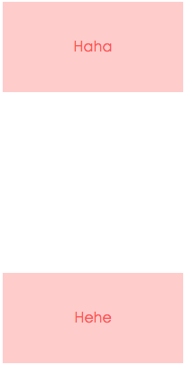

## **BFC**

[BFC详解看这里](https://www.zhangxinxu.com/wordpress/2015/02/css-deep-understand-flow-bfc-column-two-auto-layout/)

[还可以看这里](https://www.cnblogs.com/lhb25/p/inside-block-formatting-ontext.html)

### **一、BFC是什么**

&emsp;&emsp;先来了解下 Box、Formatting Context 的概念。

**Box：CSS 布局的基本单位**

&emsp;&emsp;Box 是 CSS 布局的对象和基本单位，直观点说，就是一个页面由多个 Box 组成的。元素类型和 display 属性决定了这个 Box 的类型，不同类型的 Box 会参与不同的 Formatting Context（一个决定如何渲染文档的容器），因此 Box 内的元素会以不同的方式渲染。

&emsp;&emsp;让我们看看有哪些盒子：
- block0leve box：display 属性为 block、list-item、table 的元素，会生成 block-level box，并且参与 block formatting context
- inline-level box：display 属性为 inline、inline-block、inline-table 的元素，会生成 inline-level box，并且参与 inline formatting context
- run-in box：CSS3 中才有，先不讲

**Formatting Context**

&emsp;&emsp;Formatting context 是 W3C CSS2.1 规范中的一个概念，它是页面中的一块渲染区域，并且有一套渲染规则，它决定了其子元素将如何定位，以及和其他元素的关系和相互作用。最常见的 Formatting context 有 BFC 和 IFC，CSS3 中还增加了 GFC 和 FFC。

**BFC定义：BFC(Block formatting context)直译为“块级格式化上下文”**。它是一个独立的渲染区域，只有 Block-level box 参与，它规定了内部的 Block-level box 如何布局，并且与这个区域外部毫不相干。

**BFC布局规则**
1. 内部的 Box 会在垂直方向，一个接一个地放置
2. Box 垂直方向的距离由 margin 决定。属于同一个 BFC 的两个相邻 Box 的 margin 会发生重叠（margin重叠的问题可以看[盒子模型](./3、盒子模型.md)和[margin](./10、margin.md)部分）
3. 每个元素的 margin box 的左边，与包含块 border box 的左边相接触（对于从左往右的格式化而言，否则相反）。即使存在浮动也是如此
4. BFC 的区域不会与 float box 重叠
5. BFC 就是页面上的一个隔离的独立容器，容器里面的子元素不会影响到外面的元素，反之也是如此
6. 计算 BFC 的高度时，浮动元素也参与计算

### **二、哪些元素会生成 BFC**

1. 根元素
2. float 属性不是 none
3. position 为 absolute 或 fixed
4. display 为 inline-block、table-cell、table-caption、flex、inline-flex
5. overflow 不是 visible

### **三、BFC 的作用及原理**

#### **1、自适应两栏布局**

先给出一个简单的示例：
```html
<style>
    body {
        width: 300px;
        position: relative;
    }

    .aside {
        width: 100px;
        height: 150px;
        float: left;
        background: red;
    }

    .main {
        height: 200px;
        background: pink;
    }
</style>
<body>
    <div class="aside"></div>
    <div class="main"></div>
</body>
```


&emsp;&emsp;根据 BFC 布局的第三条规则：<font color="red">每个元素的 margin box 的左边，与包含块 border box 的左边相接触（对于从左往右的格式化，否则相反）。即使存在浮动也是如此。</font>

&emsp;&emsp;因此，虽然存在浮动的元素 `aside`，但 `main` 的左边依然会与包含块的左边相接触

&emsp;&emsp;根据第四条规则：<font color="red">BFC 的区域不会与 float box 重叠。</font>我们可以通过触发 `main` 生成 BFC，来实现自适应两栏布局
```css
.main {
    overflow: hidden;
}
```
&emsp;&emsp;当触发 `main` 生成 BFC 后，这个新的 BFC 不会与浮动的 `aside` 重叠，因此会根据包含块的宽度、和 `aside` 的宽度，自动变窄，效果如下：


#### **2、清除内部浮动**

```html
<style>
    .par {
        border: 5px solid #fcc;
        width: 300px;
    }
 
    .child {
        border: 5px solid #f66;
        width:100px;
        height: 100px;
        float: left;
    }
</style>
<body>
    <div class="par">
        <div class="child"></div>
        <div class="child"></div>
    </div>
</body>
```


&emsp;&emsp;根据 BFC 布局规则第六条：<font color="red">计算 BFC 高度时，浮动元素也参与计算。</font>

&emsp;&emsp;为达到清除内部浮动的目的，我们可以触发 `par` 生成 BFC，那么 `par` 在计算高度时，`par` 内部的浮动元素 `child` 也会参与计算。

```css
.par {
    overflow: hidden;
}
```
效果如下：


#### **3、防止垂直 margin 重叠**

```html
<style>
    p {
        color: #f55;
        background: #fcc;
        width: 200px;
        line-height: 100px;
        text-align:center;
        margin: 100px;
    }
</style>
<body>
    <p>Haha</p>
    <p>Hehe</p>
</body>
```


&emsp;&emsp;两个 `p` 之间的距离为 100px，发生了 margin 的上下重叠。

&emsp;&emsp;根据 BFC 布局规则第二条：<font color="red">Box 垂直方向的距离由 margin 决定。属于同一个 BFC 的两个相邻 Box 的 margin 会重叠。</font>

&emsp;&emsp;我们可以在 `p` 外面包裹一层容器，并触发该容器生成一个 BFC。那么两个 `p` 就不属于同一个 BFC，就不会发生重叠了。

```html
<style>
    .wrap {
        overflow: hidden;
    }
    p {
        color: #f55;
        background: #fcc;
        width: 200px;
        line-height: 100px;
        text-align:center;
        margin: 100px;
    }
</style>
<body>
    <p>Haha</p>
    <div class="wrap">
        <p>Hehe</p>
    </div>
</body>
```



### **总结**

&emsp;&emsp;以上的几个例子都体现了布局的第五条规则：<font color="red">BFC 就是页面上的一个隔离的独立容器，容器里面的子元素不会影响到外面的元素，反之亦然。</font>

&emsp;&emsp;因为 BFC 内部的元素和外部的元素绝对不会相互影响，因此当 BFC 外部存在浮动时，它不应该影响 BFC 内部 box 的布局，BFC 会通过变窄，而不与浮动有重叠。同样的，当 BFC 内部有浮动时，为了不影响外部元素的布局，BFC 计算高度时会包括浮动的高度。避免 margin 重叠也是一个道理。
