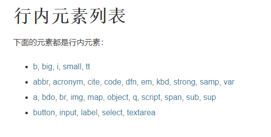
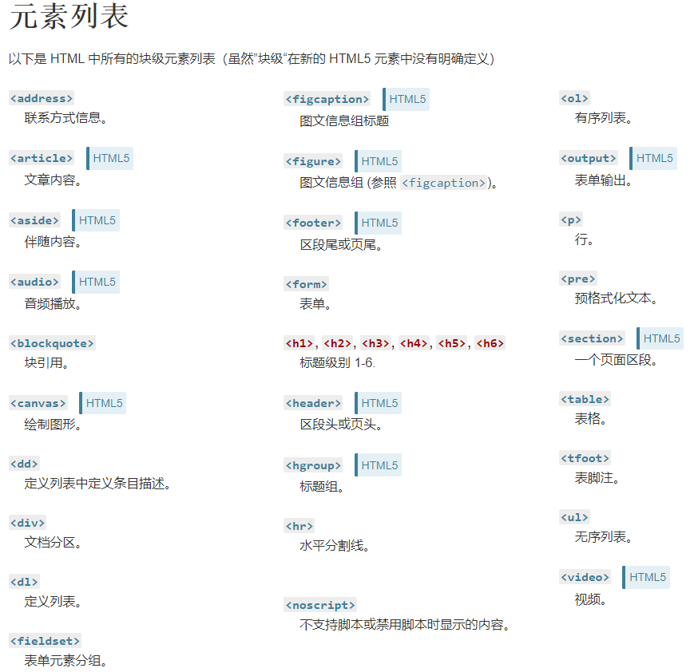

## **盒子模型**

### **目录**
- [盒子模型](#box)
- [小插曲——display](#display)
- [行内元素和块级元素](#inline-block)
- [margin外边距](#margin)
- [margin为负值](#negative-margin)
- [border的用法](#border)
- [](#)
---

https://developer.mozilla.org/zh-CN/docs/Web/CSS/display

https://juejin.cn/post/6847902222106230797

https://www.cnblogs.com/xiaohuochai/p/5314289.html

https://github.com/zuopf769/notebook/blob/master/fe/CSS%E5%A4%96%E8%BE%B9%E8%B7%9D(margin)%E9%87%8D%E5%8F%A0%E5%8F%8A%E9%98%B2%E6%AD%A2%E6%96%B9%E6%B3%95/README.md

外边距重叠 https://www.jianshu.com/p/eb5061310246

## <span id="box">**盒子模型**</span>

**设置两种不同的盒子，使用 `box-sizing` 属性，其值一个是 `border-box`，另一个是 `content-box`。**

来看两张图


---
## <span id="display">**display**</span>
```
根据 MDN 上的描述，`display` 这个属性可以设置元素的内部和外部显示类型。

元素的外部显示类型 outer display types 会决定该元素在流式布局中的表现（块级或内联）；

元素的内部显示类型 inner display types 可以控制其子元素的布局（flow layout、grid 或 flex）
```

- **display-outside**
    - block
    - inline
- **display-inside**
    - flex
    - grid
    - table
    - flow
    - flow-root
    - ruby
- **display-legacy**
    - inline-block
    - inline-flex
    - inline-grid
    - inline-table

---
## <span id="inline-block">**行内元素和块级元素**</span>

&emsp;&emsp;行内元素和块级元素都是元素种类的一种，可以通过 `display` 来相互转换。

&emsp;&emsp;**行内元素（inline）的特征有：**
- 宽高设置无效
- margin左右有效，上下无效
- 不会自动换行

&emsp;&emsp;**块级元素（block）的特征：**
- 可以设置宽高
- margin上下左右都有效
- 可以自动换行
- 多个块级元素标签，默认是从上到下排列

&emsp;&emsp;**行内块级元素（inline-block）特征：**
- 不会自动换行
- 可以识别宽高
- 默认是从左往右排列
- 上下方向的margin负值看上去无效，与默认的 `vertical-align: baseline` 有关系，当垂直对齐的属性值为其他值时，会呈现不同的视觉效果

**行内元素如下：**


**块级元素如下：**



---
## <span id="margin">**margin外边距**</span>

&emsp;&emsp;`margin` 的值可以为**正**也可以为**负**。联系上文可知，
- 块级元素的四个方向 `margin` 都有效
- 行内元素的上下方向 `margin` 无效
- 行内块级元素的上下方向 `margin` 无效

&emsp;&emsp;`margin` 存在一种外边距重叠的现象。它指的是，当两个垂直外边距相遇时，它们将合并成一个外边距。其合并规则如下：
- 如果两个外边距值都为正，那么两个盒子垂直方向的距离是两个外边距中的更大的那个值
- 如果一正一负，就是正边距减去负边距值得绝对值
- 如果两个外边距值都是负，则用 0 减去绝对值更大的负边距

---
## <span id="negative-margin">**margin为负值**</span>
&emsp;&emsp;`margin` 为负值时，并不总是后面的元素覆盖前面的元素，与其 `display` 属性有关。
1. 两个块级元素（block）重叠时，后面元素**可以覆盖前面元素的背景，但无法覆盖其内容**
2. 两个行内元素（inline）或两个行内块级元素（inline-block）或者行内元素（inline）与行内块级元素（inline-block）重叠时，**后面元素可以覆盖前面元素的背景和内容**
3. 行内元素（inline）或者行内块级元素（inline-block）和块级元素（block）重叠时，行内元素（inline）或者行内块级元素（inline-block）覆盖块级元素（block）的背景，而后面的元素会覆盖前面的元素的内容

```
    可以这样理解，普通流布局中，浏览器将页面布局分为内容和背景，内容层叠始终高于背景，块级元素（block）分为内容和背景两部分，而行内元素（inline）和行内块级元素（inline-block）其本身被视作内容（包括了其背景样式等）
```
4. 块级元素（block）与浮动元素重叠时，背景和边框在浮动元素之下，内容在浮动元素之上
5. 行内元素（inline）或者行内块级元素（inline-block）与浮动元素重叠时，背景、边框和内容都在浮动元素之上

6. 定位元素（position不是static）覆盖其他元素的背景和内容
7. 行内元素（inline）设置为 `relative` ，由于无法改变其行内元素的本质，所以上下 `margin` 依然存在问题


