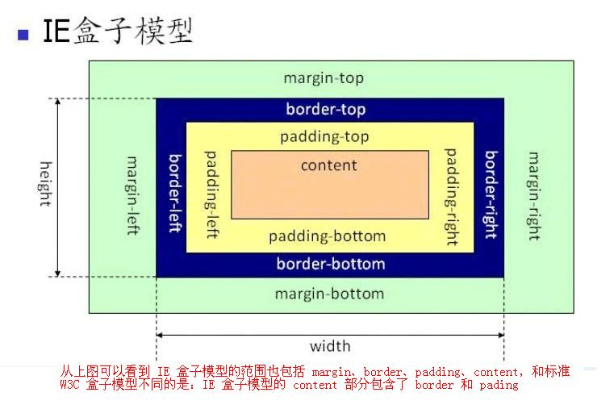

## **盒子模型**

目录
- [盒子模型](#box)
- [小插曲——display](#display)
- [行内元素和块级元素](#inline-block)
- [margin外边距](#margin)
- [](#)
- [](#)
- [](#)
---

https://developer.mozilla.org/zh-CN/docs/Web/CSS/display

https://juejin.cn/post/6847902222106230797

https://www.cnblogs.com/xiaohuochai/p/5314289.html

https://github.com/zuopf769/notebook/blob/master/fe/CSS%E5%A4%96%E8%BE%B9%E8%B7%9D(margin)%E9%87%8D%E5%8F%A0%E5%8F%8A%E9%98%B2%E6%AD%A2%E6%96%B9%E6%B3%95/README.md

https://github.com/w3c/csswg-drafts/issues/3482


## <span id="box">**盒子模型**</span>

来看两张图




---
## <span id="display">**display**</span>
```
根据 MDN 上的描述，`display` 这个属性可以设置元素的内部和外部显示类型。

元素的外部显示类型 outer display types 会决定该元素在流式布局中的表现（块级或内联）；

元素的内部显示类型 inner display types 可以控制其子元素的布局（flow layout、grid 或 flex）
```

- **display-outside**
    - block
    - inline
- **display-inside**
    - flex
    - grid
    - table
    - flow
    - flow-root
    - ruby
- **display-legacy**
    - inline-block
    - inline-flex
    - inline-grid
    - inline-table

---
## <span id="inline-block">**行内元素和块级元素**</span>

&emsp;&emsp;行内元素和块级元素都是元素种类的一种，可以通过


---
## <span id="margin">**margin外边距**</span>

&emsp;&emsp;`margin` 的值可以为**正**也可以为**负**。当 `margin` 是正数时没什么需要讲的
