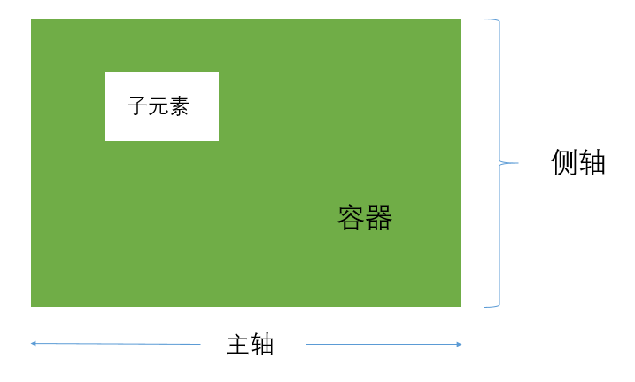
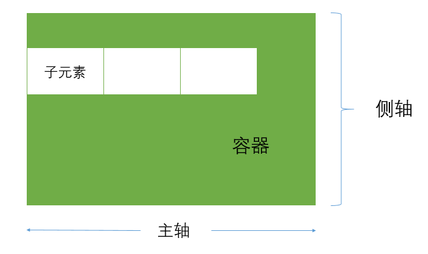
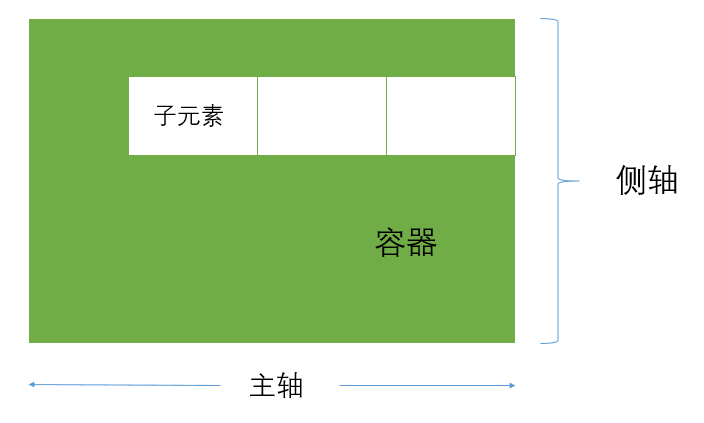
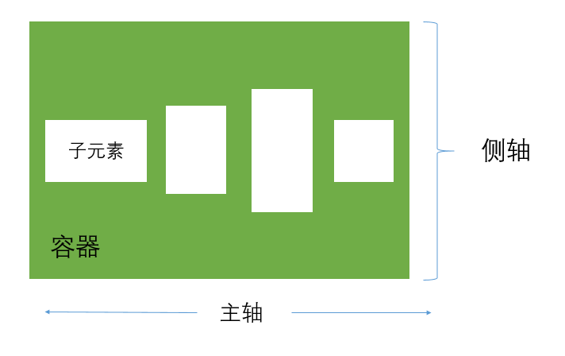
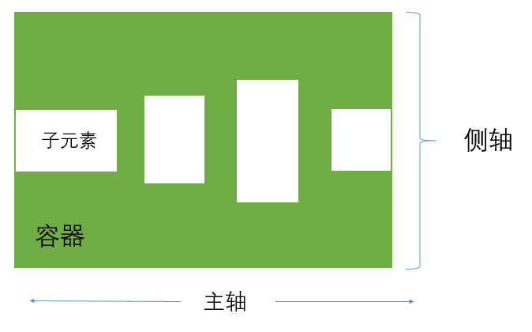
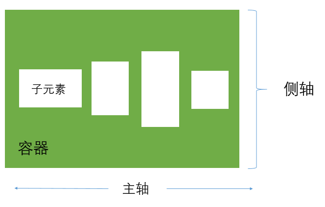
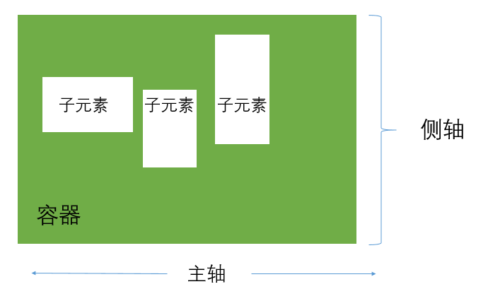
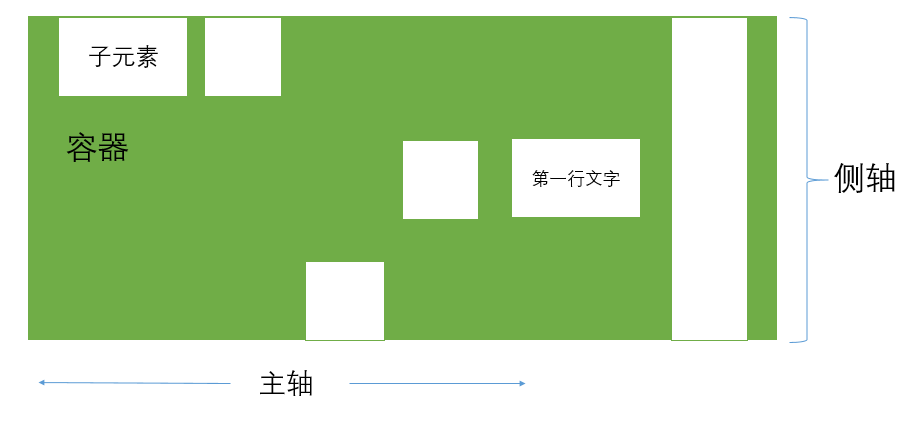

# flex布局

## 一、flex布局简介

&emsp;&emsp;flex布局就体现在那个“flex”上，是十分灵活的弹性布局。其主要概念有：容器、子元素、主轴、侧轴（默认的主轴和侧轴可更改）。



针对子元素，同样也有自身的主轴和侧轴属性。

## 二、flex布局容器详细介绍

&emsp;&emsp;首先介绍容器可设置的属性，需要注意的是，一旦容器设置为flex布局，子元素的`float`、`clear`和`vertical-aligin`将会失效。
第一步，将容器设置为
```css
display: flex;
```

### `flex-direction`

&emsp;&emsp;该属性设置容器的主轴方向，默认值为`row`即水平方向，且主轴的起点在左端，其他可选值为`row-reverse`，区别在于主轴起点为右端；`column`设置主轴起点为垂直方向，起点在上端；`column-reverse`的起点反之。

### `flex-wrap`

&emsp;&emsp;该属性将确定容器内子元素是否允许换行，默认为`nowrap`不换行，可选值有`wrap`，支持换行，且第一行位于最上方；`wrap-reverse`支持换行，但第一行位于最下方。

### `flex-flow`

&emsp;&emsp;`flex-flow`能够一次性设置以上两个属性，格式如下：
```css
flex-flow: <'flex-direction'> || <'flex-wrap'>  //  默认值为row nowrap
```

### `justify-content`

&emsp;&emsp;`justiry-content`用于指定子元素在主轴方向上的对齐方式。
- 默认值为`flex-start`，即向主轴起点对齐；



- `flex-end`主轴终点对齐；



- `center`居中；



- `space-between`往起点、终点两端对齐，子元素相互之间间隔相等；



- `space-around`每个元素两侧间隔相等；



### `align-items`

&emsp;&emsp;`align-items`指定子元素在侧轴方向上的对齐方式。

- `flex-start`侧轴起点对齐；

- `flex-end`侧轴终点对齐；

- `center`居中；

- `baseline`子元素第一行文字基线对齐（如下图所示）：



- `stretch`若子元素未设置高度或者高度为auto，将占满所有高度；

### `align-content`

&emsp;&emsp;`align-content`定义多个主轴在侧轴上的对齐方式，当有且仅有一个主轴时将失效，可选值依旧是几个老面孔。

- `flex-start`

- `flex-end`

- `center`

- `space-between`起点和终点对齐后，子元素相互之间间隔相等；

- `space-around`每个主轴两侧间距相等；

- `stretch`将拉伸子元素填满侧轴空间。

## flex布局子元素详细介绍

### `order`

&emsp;&emsp;`order`属性控制子元素的排列顺序，数值越小排位越靠前，默认值为0。

### `flex-grow`和`flex-shrink`

&emsp;&emsp;`flex-grow`指定子元素放大比例，默认值为0，设置为1表示有空间将放大。`flex-shrink`则表示缩小比例，默认值为1，表示空间不足将会缩小，设置为0则表示不缩小。

### `flex-basis`

&emsp;&emsp;`flex-basis`定义分配多余空间之前，子元素占据的主轴空间。浏览器也根据这个属性来计算主轴上是否有多余空间。默认值为auto，即子元素本来的大小。

### `flex`

&emsp;&emsp;`flex`是以上三个属性的综合版，格式如下
```css
flex: <'flex-grow'><'flex-shrink'>? || <'flex-basis'>
//  默认值为
flex: 0 1 auto;
```

### `align-self`

&emsp;&emsp;`align-self`指定子元素自身的对齐方式，可以覆盖`align-items`的值，当分别设置为`auto`、`flex-start`、`flex-end`、`center`、`baseline`、`stretch`时效果如下：

