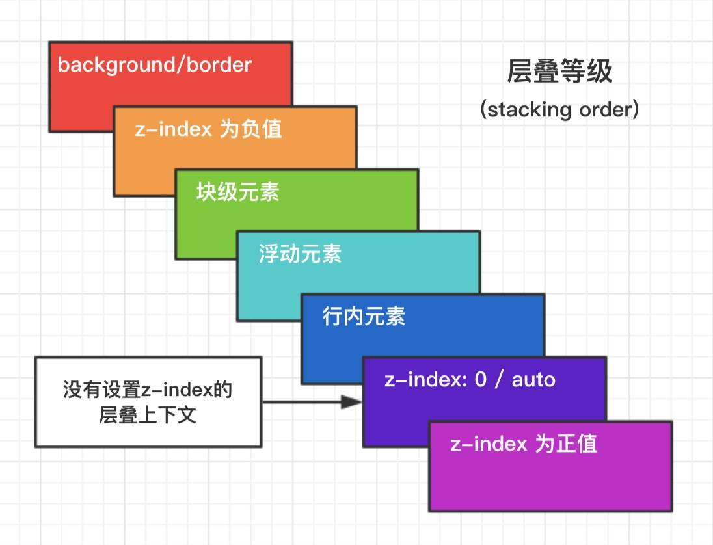

## **层叠上下文**

[点击这里看大佬讲解层叠上下文的好文](https://www.zhangxinxu.com/wordpress/2016/01/understand-css-stacking-context-order-z-index/)

### **一、概念**

&emsp;&emsp;需要分清楚，**层叠上下文、层叠水平、层叠顺序**三者之间有什么区别。

1. **层叠上下文**

&emsp;&emsp;一个元素含有层叠上下文，就可以理解为这个元素在 z 轴上“高人一等”。

2. **层叠水平**

&emsp;&emsp;层叠水平决定了同一个层叠上下文中元素在 z 轴上的显示顺序。普通元素的层叠水平由层叠上下文决定，因此层叠水平的比较只有在当前层叠上下文元素中才有意义。

3. **层叠顺序**

&emsp;&emsp;层叠顺序表示元素发生层叠时有着特定的垂直显示顺序。**层叠上下文和层叠水平是概念，而层叠顺序是规则**。




有两条元素发生层叠时候的规则：

- **谁大谁上**：当具有明显的层叠水平标示的时候，如识别z-index的值，在同一个层叠上下文领域，层叠水平值大的那一个覆盖小的那一个
- **后来居上**：元素的层叠水平一致，层叠顺序相同时，在DOM流中处于后面的元素会覆盖前面的元素

注意：

- 位于最低水平的 `border/background` 指的是层叠上下文元素的边框和背景色。每一个层叠顺序规则适用于一个完整的层叠上下文元素。
- `inline-block` 和 `inline` 元素是同等级别的
- `z-index: 0` 实际上和 `z-index: auto` 单纯从层叠水平上看，可以看成一样的。实际上两者在层叠上下文领域有根本性的差异。

### **二、层叠上下文特性**

&emsp;&emsp;层叠上下文元素有如下特性：
1. 层叠上下文的层叠水平比普通元素高
2. 层叠上下文可以阻断元素的混合模式
3. 层叠上下文可以嵌套，内部层叠上下文及其子元素均受制于外部的层叠上下文
4. 每个层叠上下文和兄弟元素独立，也就是当进行层叠变化或渲染的时候，只考虑后代元素
5. 每个层叠上下文自成体系，当元素发生层叠的时候，整个元素被认为是在父层叠上下文的层叠顺序中

（大佬的描述）翻译成真实世界语言就是：

1. 当官的比老百姓更有机会面见圣上；
2. 领导下去考察，会被当地官员阻隔只看到繁荣看不到真实民情；
3. 一个家里，爸爸可以当官，孩子也是可以同时当官的。但是，孩子这个官要受爸爸控制。
4. 自己当官，兄弟不占光。有什么福利或者变故只会影响自己的孩子们。
5. 每个当官的都有属于自己的小团体，当家眷管家发生摩擦磕碰的时候（包括和其他官员的家眷管家），都是要优先看当官的也就是主子的脸色。

### **三、层叠上下文的创建**

&emsp;&emsp;层叠上下文是由一些特定的 CSS 属性创建的，总结如下：
1. 页面根元素天生具有层叠上下文，称之为“根层叠上下文”
2. z-index 值为数值的定位元素。

&emsp;&emsp;对于包含 `position:relative` `position:absolute` 的定位元素，当其`z-index`不是 `auto` 时会创建层叠上下文。

1. 其他 CSS3 属性

   - flex 和 inline-block

   &emsp;&emsp;父级是`display: flex`或`display:inline-block`，且子元素的`z-index`不是`auto`必须是数值，那么这个**子元素**就会变成层叠上下文元素。注意了，是子元素变成层叠上下文元素，而不是父级元素。

   举例说明：

   ```jsx
         <div
           style={{
             // display: 'flex'
           }}
         >
           <div
             style={{
               backgroundColor: '#cfc',
               zIndex: 1
             }}
           >
             
           </div>
         </div>
   ```

   

   &emsp;&emsp;此时背景会在图片之上。而如果将父级添加了`flex`后，就会让子元素变成层叠上下文，根据张鑫旭版规则图片来看，层叠上下文元素和background、border一样都在最下面，因此即使它的`z-index`是1，也依旧在`z-index`为负的图片之下：

   

   - opacity

   &emsp;&emsp;元素自身的`opacity`不为1，就会变成层叠上下文，上例中如果将图片的父元素添加`opacity: 0.5`，也会导致图片置于背景之上。

   ```jsx
   <div style={{opacity: 0.5}}>
   	
   </div>
   ```

   

   - transform

   &emsp;&emsp;使用了`transform`的元素同样具有层叠上下文，与`opacity`一样：

   ```jsx
   <div style={{transform: rotate(15deg)}}>
       
   </div>
   ```

   

   - filter

   &emsp;&emsp;`filter`是css3中规范的滤镜属性，使用如图所示：

   ```jsx
   <div style={{filter: blur(5px)}}>
   	
   </div>
   ```

   

   - will-change

   &emsp;&emsp;这个属性用于提升页面滚动、动画等渲染性能，类似于告诉浏览器*“我这里要有大动作了，你赶紧做好准备”*。具体可以看[这里](https://www.zhangxinxu.com/wordpress/2015/11/css3-will-change-improve-paint/)。

### **层叠上下文与层叠顺序**

&emsp;&emsp;文中多次提到，普通元素一旦具有了层叠上下文，其层叠顺序就会变高，那它究竟在哪个位置呢？

&emsp;&emsp;需要分两种情况讨论：

1. 如果层叠上下文元素不依赖`z-index`数值，则其层叠顺序是`z-index:auto`，可看成`z-index:0`；
2. 如果层叠上下文元素依赖`z-index`数值，就由其数值决定。

&emsp;&emsp;**问个问题，为什么定位元素会层叠在普通元素上面？**

&emsp;&emsp;答：根本原因在于，元素一旦成为定位元素，其`z-index`就会自动生效，此时为默认的auto，也就是0级别，根据终极版顺序表可知，它高于inline、block或浮动元素。