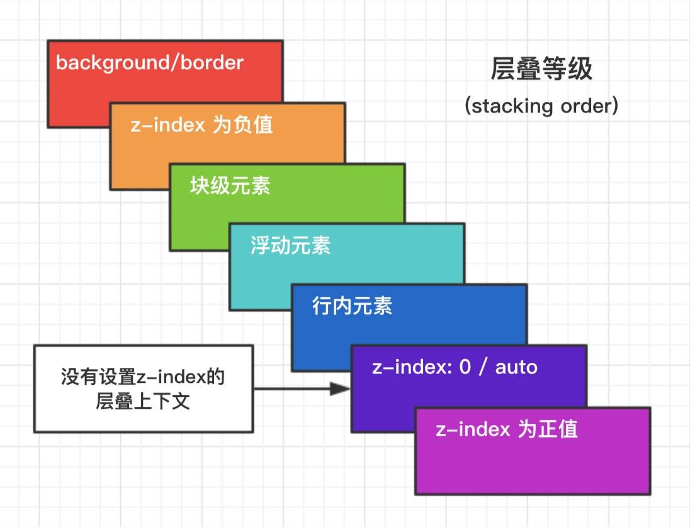

## **层级上下文**

&emsp;&emsp;元素提升为一个比较特殊的图层，在三维空间中（z-index）高出普通元素一等

- 触发条件
    - 根层叠上下文（html）
    - position
    - css3属性
        - flex
        - transform
        - opacity
        - filter
        - will-change
        - -webkit-overflow-scrolling

- 层叠等级：层叠上下文在z轴上的排序
    - 在同一层叠上下文中，层叠等级才有意义
    - z-index优先级最高

## **什么是BFC**

&emsp;&emsp;W3C对BFC的定义如下：
- 浮动元素和绝对定位元素
- 非块级盒子的块级容器（inline-blocks,table-cells,table-captions)
- overflow值不为"visible"的块级盒子
都会为他们的内容创建新的BFC（Block Fromatting Context，即块级格式上下文）

## **触发条件**

&emsp;&emsp;一个HTML元素要创建BFC，满足下列任意一个或多个条件即可：
- 根元素
- 浮动元素（float不是none）
- 绝对定位元素（position为absolute或fixed）
- 行内块元素（display为inline-block）
- 表格单元格（display为table-cell，HTML表格单元格默认为该值）
- 表格标题（display为table-caption，HTML表格标题默认为该值）
- 匿名表格单元格元素（display为table、table-row、table-row-group、table-header-group、table-footer-group）
- overflow值不为visible的块元素、弹性元素（display为flex或inline-flex元素的直接子元素）
- 网格元素（display为grid或inline-grid元素的直接子元素）

## **BFC渲染规则**

1. BFC垂直方向边距重叠
2. BFC的区域不会与浮动元素的box重叠
3. BFC是一个独立的容器，外面的元素不会影响里面的元素
4. 计算BFC高度的时候浮动元素也会参与计算

## **应用场景**

1. 防止浮动导致父元素高度坍塌

2. 避免外边距折叠

