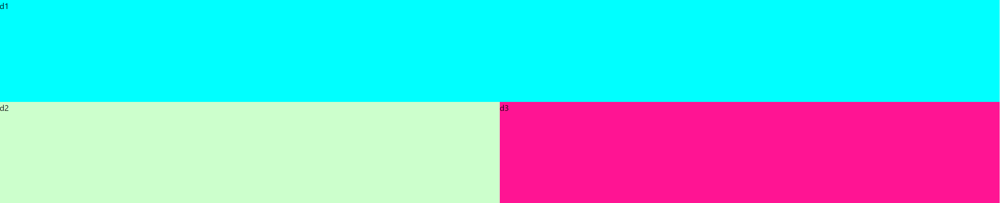
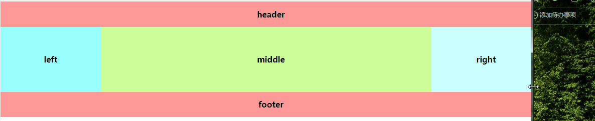
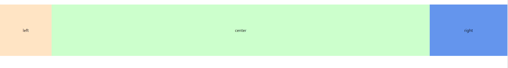
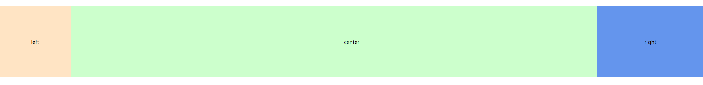
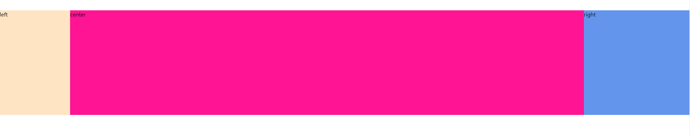

# 品字、圣杯、双飞翼布局

### 品字布局

&emsp;&emsp;品字布局，可以分为两种，其一是真的品字，其二是上者宽度100%而下两者各自宽50%。

&emsp;&emsp;针对情况一，可以有以下 DOM 结构：

```html
<div>
    <div className="d1" />
    <div className="d2" />
    <div className="d3" />
</div>
```

```css
.d1, .d2, .d3 {
    width: 200px;
    height: 200px;
    background-color: #cfc;
}

.d1 {
    margin: 0 auto;
}

.d2 {
    //	display: inline-block;
    float: left;
    margin-left: 50%;
}

.d3 {
    //	display: inline-block;
    float: left;
    margin-left: -400px;
}
```

&emsp;&emsp;效果如下：


&emsp;&emsp;面对情况二，宽度就如同那样所说的设置即可，唯一要考虑的是如何将下两个放在同一行，这也好办，`inline-block`和`float`均可。

```jsx
  <div>
    <div
      style={{
        width: '100%',
        height: 200,
        backgroundColor: 'aqua',
        margin: '0 auto'
      }}
    >
      d1
    </div>

    <div
      style={{
        width: '50%',
        height: 200,
        display: 'inline-block',
        backgroundColor: '#cfc',
      }}
    >
      d2
    </div>
    
    <div
      style={{
        width: '50%',
        height: 200,
        display: 'inline-block',
        backgroundColor: 'deeppink',
      }}
    >
      d3
    </div>
  </div>
```

&emsp;&emsp;效果如图：



### 圣杯、双飞翼布局

&emsp;&emsp;这两个布局的要求相同：

1. 三列布局，中间宽度自适应，两边定宽；
2. 中间栏要在浏览器中优先渲染（即中间的盒子其实是父元素的第一个子元素）；
3. 允许任意列的高度最高；
4. 用最简单的CSS、最少的代码；

&emsp;&emsp;要求效果如下：



#### 圣杯布局

```html
  <div
    className="content"
  >
    <div
      className="center"
    >
      center
    </div>
    <div
      className="left"
    >
      left
    </div>
    <div
      className="right"
    >
      right
    </div>
  </div>
```

```css
.content {
  padding: 0 300px 0 200px;
  overflow: hidden;
}

.left, .right, .center {
  position: relative;
  float: left;
  height: 200px;
  line-height: 200px;
  text-align: center;
}

.left {
  margin-left: -100%;
  left: -200px;
  width: 200px;
  background-color: bisque;
}

.right {
  margin-left: -300px;
  right: -300px;
  width: 300px;
  background-color: cornflowerblue;
}

.center {
  width: 100%;
  background-color: #cfc;
}
```



#### 双飞翼布局

```css
.left, .center, .right {
  float: left;
  height: 200px;
  line-height: 200px;
  text-align: center;
}

.left {
  margin-left: -100%;
  width: 200px;
  background-color: bisque;
}

.right {
  margin-left: -300px;
  width: 300px;
  background-color: cornflowerblue;
}

.center {
  width: 100%;
  background-color: #cfc;
}
```



&emsp;&emsp;两者**区别**在于：

- 圣杯布局在浮动的基础上添加相对定位，配合`left`和`right`属性，效果上三栏是单独分开的；
- 双飞翼布局在中间盒子宽度设为 100% ，左右两栏显示在中间栏的上面，其内容通过`margin-left` `margin-right`显示在中间。

#### flex布局实现

&emsp;&emsp;我个人比较喜欢用 **flex** 布局，因此这里给出我的一个解决方法，其中，用 `order` 属性控制主轴上左、中、右的排列顺序，`flex-grow`控制中间盒子自适应大小，后两者高度是跟着左盒子高度而同步的：

```css
.content {
  display: flex;
  justify-content: space-between;
}

.left {
  width: 200px;
  height: 200px;
  background-color: bisque;
}

.center {
  order: 2;
  flex-grow: 1;
  background-color: deeppink;
}

.right {
  order: 3;
  width: 300px;
  background-color: cornflowerblue;
}
```

