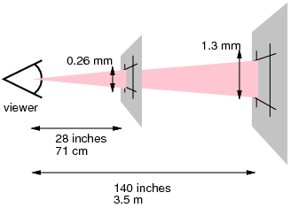

目录
- [像素](#pixel)
- [viewport](#viewport)

[可以看看这里](https://www.cnblogs.com/zaoa/p/8630393.html)

### <span id="pixel">**像素**</span>

1. 概念

名词|含义
--|--
px|css像素
DP(Device Pixels)|设备像素
DIP(Device Independent Pixel)|逻辑像素（设备独立像素）
DPR(Device Pixels Ratio)|设备像素比
PPI(Pixels Per Inch)|像素密度
<br />

2. 释义
    - px

      px是在 CSS/JS 中使用的，相对设备像素的一种单位。它的目的在于使浏览器中 1px 在不同物理设备中被看到的大小基本一致。浏览器按照设备的物理像素进行换算，CSS中使用[参考像素](#reference-pixel)进行换算

    - DP

      设备像素就是实际屏幕拥有的像素点

    - DIP

      可以理解为反映在 CSS/JS 程序里面的像素点，CSS像素是逻辑像素的一种。
      ```
        css像素 = 设备独立像素 = 逻辑像素
      ```
      在移动端浏览器及某些桌面浏览器中，window 对象有一个 `devicePixelRatio` 属性，它的官方定义为：设备物理像素和设备独立像素的比例，也就是 devicePixelRatio = 物理像素 / 独立像素

    - DPR

      一个设备的物理像素与逻辑像素之比。例如使用2x2像素点来表示1px时，DPR = 2

    - PPI

      每英寸像素取值，即像素密度。计算方式为使用一块屏上某一边的像素点的数量除以该边的长度。例如 1920x1080 分辨率的屏，1080/屏的宽度，就是PPI

    - 屏幕尺寸

      i. 屏幕尺寸和分辨率没有直接关系，而与PPI即像素密度有关。同分辨率，尺寸越大，PPI越低；

      ii. 一粒像素的明确大小是不定的，同样分辨率，尺寸越大，一粒像素一定越大

3. <span id="reference-pixel">参考像素(reference pixel)</span>

参考像素的定义如下：
```
The reference pixel is the visual angle of one pixel on a device with a pixel density of 96dpi and a distance from the reader of an arm's length. For a nominal arm's length of 28 inches, the visual angle is therefore about 0.0213 degrees.
```

即css参考像素是一个 `visual angle` ，一个约等于0.0213度的角。当设备的观看距离越远时，参考像素就越大（角度对应在屏幕上的尺寸变大）




### <span id="viewport">**viewport**</span>

