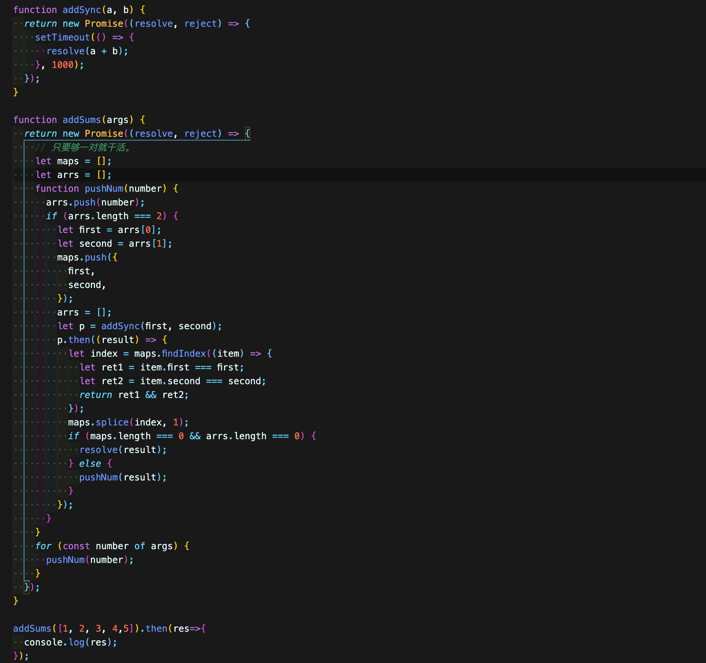

## 目录

- [flex布局](#flex)
- [JavaScript](#javascript)
- [promise](#promise)
- [宏任务、微任务](#macro-micro)
- [ES6 class](#class)
- [操作符相关](#caozuofu)
- [模板字符串](#modelstring)
- [扩展运算符](#kuozhanyunsuanfu)
- [](#)
- [](#)
- [](#)
- [](#)

---
## <span id="flex">flex用法</span>


---
## <span id="javascript">JavaScript</span>

- 说说代码执行结果
```js
function Foo() {
    Foo.a = function() {
        console.log(1)
    }
    this.a = function() {
        console.log(2)
    }
}
Foo.prototype.a = function() {
    console.log(3)
}
Foo.a = function() {
    console.log(4)
}
Foo.a();
let obj = new Foo();
obj.a();
Foo.a();
```
&emsp;&emsp;第一个应该是4，因为定义的就是 `Foo.a` 等于输出4的函数；第二个应该是2，因为 `Foo` 作为构造函数时，将生成的对象的 `a` ，即 `this.a` 设定为了输出2的函数；第三个是1，因为执行构造函数 `Foo` 的时候将 `Foo.a` 重新赋值了。

- 这段代码呢
```js
function Foo() {
    getName = function() {
        console.log(1);
    }
    return this;
}

Foo.getName = function() {
    console.log(2);
}

Foo.prototype.getName = function() {
    console.log(3);
}

var getName = function() {
    console.log(4);
}

function getName() {
    console.log(5);
}

Foo.getName();
getName();
Foo().getName();
getName();
Foo.getName();
```
&emsp;&emsp;结果是 2 4 1 1 2。关键点有两个，其一是打印的第二个为4，因为JavaScript执行顺序中函数的声明在变量的声明之前，所以不管先写getName的函数定义还是变量定义，getName都会被设定为变量对应的值，即输出4；其二是输出的第一个1，因为Foo函数执行后返回的this是全局的，而Foo函数里面最先把全局的getName重新赋值为了输出1的函数，因此会打印1，后面一个也打印1.


---

## <span id="promise">promise相关</span>

1. 下列两块代码执行结果分别如何
```js
let a = 0;
let b = () => {
    new Promise((resolve) => {
        resolve(10);
    })
    .then(value => {
        a = a + value;
        console.log('qqq', a);
    });
}
b();
a++;
console.log('www', a);
```

```js
let c = 0;
let d = async () => {
    c = c + await 10;
    console.log('eee', c);
}
d();
c++;
console.log('rrr', c);
```

下面揭晓答案
```js
//  第一部分代码
www，1
qqq，11

//  第二部分
rrr，1
eee，10
```
解析过程中，可以再来看看以上两部分代码的更新版
```js
let a = 0;
let b = () => {
    new Promise((resolve) => {
        resolve(10);
    })
    .then(value => {
        console.log('now', a);
        a = a + value;
        console.log('qqq', a);
    });
}
b();
a++;
console.log('www', a);

//  www 1
//  now 1
//  qqq 11
```
```js
let c = 0;
let d = async () => {
    console.log('fff', c);
    c = c + await e();
    console.log('eee', c);
}
let e = function() {
    console.log('now', c);
    return 10;
}
d();
c++;
console.log('rrr', c);

//  fff 0
//  now 0
//  rrr 1
//  eee 10
```

可以发现，`async/await` 中的变量值是被“冰冻保存下来的”，因此打印出来还是0。阮一峰的ES6讲解，关于 `Generator` 与上下文部分中说明了
```
JavaScript 代码运行时，会产生一个全局的上下文环境（context，又称运行环境），包含了当前所有的变量和对象。然后，执行函数（或块级代码）的时候，又会在当前上下文环境的上层，产生一个函数运行的上下文，变成当前（active）的上下文，由此形成一个上下文环境的堆栈（context stack）。

这个堆栈是“后进先出”的数据结构，最后产生的上下文环境首先执行完成，退出堆栈，然后再执行完成它下层的上下文，直至所有代码执行完成，堆栈清空。

Generator 函数不是这样，它执行产生的上下文环境，一旦遇到yield命令，就会暂时退出堆栈，但是并不消失，里面的所有变量和对象会冻结在当前状态。等到对它执行next命令时，这个上下文环境又会重新加入调用栈，冻结的变量和对象恢复执行。
```

2. 问如何在最短的时间，调用指定的 addSync 函数完成数组的求和。
```js
function addSync(a, b) {
  return new Promise((resolve, reject) => {
      setTimeout(() => {
        resolve(a+b);
      }, random);   //  setTimeout的 random 时间不定，模拟不同请求获取时常不同的特点
  });
};

//  array 是长度、内容不定的 Number数组
function addSum(array) {
  //  code
}
```

&emsp;&emsp;与其说是 `Promise` 相关，不如说是考的算法思想。两两相加所需的时间不同，如果用 `Promise.all()` 递归来处理，那么每一轮都会等待最长时间的那个完成后，才会进入下一轮。

&emsp;&emsp;一个思路是每次都两两去求和，求和后的结果放到队列里等，只要队列有两个数，就继续将他们去求和，直到最后只剩下一个数（如下所示）。


---
回调地狱

---
## <span id="macro-micro">宏任务微任务相关</span>

问以下代码执行结果如何：
```js
function test2() {
    const now = new Date();

    document.body.style.backgroundColor = 'red';

    while (new Date() - now <= 5000) {
        continue;
    };

    document.body.style.backgroundColor = "blue";
}
```

如果说是先变成红，五秒后变成蓝色，就大错特错了。

实际情况是，**浏览器会直接变成蓝色。**

<font color="red">知识点：在一个宏任务结束后，下一个宏任务开始前，浏览器才触发渲染。</font>

那么再看看下面这个代码，就可以发现不同了。
```js
function test2() {
    const now = new Date();

    setTimeout(() => {
      document.body.style.backgroundColor = 'red';
    }, 0);

    while (new Date() - now <= 5000) {
        continue;
    };

    setTimeout(() => {
        document.body.style.backgroundColor = "blue";
    }, 1000);
}
```
---
## <span id="class">**ES6 class**</span>

问输出结果如何
```js
class Chameleon {
  static colorChange(newColor) {
    this.newColor = newColor;
  }

  constructor({ newColor = "green" } = {}) {
    this.newColor = newColor;
  }
}

const freddie = new Chameleon({ newColor: "purple" });
freddie.colorChange("orange");
```
&emsp;&emsp;colorChange方法是定义的静态方法，静态方法仅仅在它们的构造函数中存在，并不能传递给任何子级。由于 `freddie` 是一个子级对象，函数不会传递，所以无法调用该方法，最终报错。


---
## <span id="caozuofu">**操作符相关**</span>

```js
let number = 0;
console.log(number++);  //  0
console.log(++number);  //  2
console.log(number);    //  2
```
&emsp;&emsp;后缀一元运算符先返回再运算，前缀一元运算符先运算再返回


---
## <span id="modelstring">**模板字符串**</span>

```js
function getPersonInfo(one, two, three) {
    console.log(one);
    console.log(two);
    console.log(three);
}

const person = "Lydia";
const age = 21;

getPersonInfo`${person} is ${age} years old`;
```
结果为
```js
[ '', ' is ', ' years old' ]
Lydia
21
```
解析：如果使用标记的模板字符串，则第一个参数的值始终是字符串值的数组。 其余参数获取传递到模板字符串中的表达式的值！

---
## <span id="kuozhanyunsuanfu">**扩展运算符**</span>
输出什么？
```js
[..."cai"]; //  ['c', 'a', 'i']
```
字符串是可迭代的。 扩展运算符将迭代的每个字符映射到一个元素。


## <span id="">****</span>
