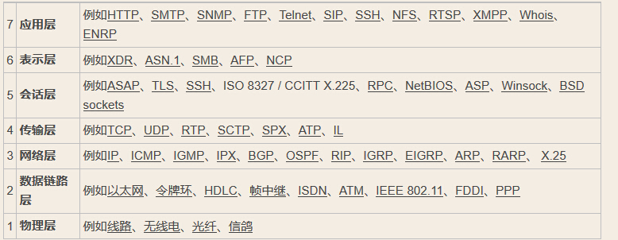

# HTTP 超文本传输协议（Hyper Text Transfer Protocol）

## 目录
- [一、http报文结构](#httpbwjg)
- [二、http请求方式](#httpqqfs)
- [三、请求方法的区别](#httpqqffdqb)
- [四、http请求状态码](#httpqqztm)
- [五、TCP和HTTP](#tcpandhttp)
- [六、网络分层](#networklayers)
- [七、HTTP和HTTPS区别](#http-https)
- [八、HTTP 长/短轮询](#long-short)

---

## **网络分层及对应协议、硬件**



---
### <span id="httpbwjg">一、http报文结构</span>

1. 对于tcp而言（网上都这么写，对tcp而言，还能对谁而言？需要好好看看）：**起始行** + **头部** + **空行** + **实体**

&emsp;&emsp;起始行分两种，请求报文的结构为**方法** + **路径** + **http版本**，例如：
```
GET /home HTTP/1.1
```
响应报文的起始行也叫**状态行**，由**http版本** + **状态码** + **原因**，例如：
```
HTTP/1.1 200 OK
```
起始行中每两个部分用空格隔开，最后一个部分后面接换行，遵循`ABNF`语法规范

http请求头结构：

http响应头结构：

对比：


&emsp;&emsp;空行的作用是分开头部和实体，空行后部的内容全部视为实体


&emsp;&emsp;http请求由三个部分组成：**请求行**、**消息报头**、**请求正文**；

---
### <span id="httpqqfs">二、http请求方式</span>
http/1.0规定了三种请求方法：GET、POST、HEAD

http/1.1新增了五种请求方法：OPTIONS、PUT、DELETE、TRACE、CONNECT
- **GET**：常用于获取数据，请求获取Request-URI所标识的资源
- **POST**：提交数据，在Request-URI所标识的资源后附加新的数据
- **PUT**：修改数据，请求服务器存储一个资源，并用Request-URI作为其标识
- **DELETE**：请求服务器删除对应所标识的资源，但注意：客户端无法保证删除操作一定会被执行，因为HTTP规范允许服务器在不通知客户端的情况下撤销请求
- **HEAD**：与GET类似（获取资源的元信息），但只请求获取有Request-URI所标识的资源的响应消息报头
- **OPTIONS**：列出可对资源实行的请求方式，用来跨域请求，成功后会在HTTP头中包含一个名为“Allow”的头，其值就是当前支持的请求方式
- **TRACE**：请求服务器回送收到的请求信息，主要用于测试或诊断。服务端在相应主体中携带它收到的原始请求报文的最终模样，客户端可以查看HTTP请求报文在发送过程中是否被修改
- **CONNECT**：建立连接隧道，用于代理服务器

---
### <span id="httpqqffdqb">三、请求方法的区别</span>
- **GET和POST**
1. 从参数角度来看，GET参数通过URL传递，POST参数放在Request Body中

2. 从缓存角度来看，GET请求后浏览器会主动缓存，POST则不会，需要手动设置

3. GET请求参数会被完整保留在浏览器的历史纪录中，POST不会

4. 从编码角度来看，GET只能进行URL编码，只能接收ASCII字符，而POST支持更多的编码类型且不对数据类型限值

5. 浏览器通常限制URL长度在2k字节，大多数服务器最多处理64k字节的URL

6. 从TCP角度来看，GET产生一个TCP数据包，浏览器会把http header和data一并发送，服务器响应200 OK并返回数据；POST产生两个TCP数据包，浏览器先发送http header，服务器响应100 continue，浏览器再发送data，服务器响应200 OK并返回数据（火狐只发送一次）

7. 从幂等性的角度来看，GET是幂等的，而POST不是

注意：幂等是指，同样的请求被执行一次与连续执行多次的效果是一样的，服务器的状态也是一样的。[参考这里](https://developer.mozilla.org/zh-CN/docs/Glossary/%E5%B9%82%E7%AD%89)

- **PUT和POST**

&emsp;&emsp;PUT和POST方法作用类似，不同在于PUT是幂等的。当多次发送相同的POST请求，服务器上的资源数目可能会增加；而PUT请求后服务器上的资源数目不会增加，每次PUT都会覆盖前一次PUT的资源

---
### <span id="httpqqztm">四、HTTP请求状态码</span>
- **信息响应**（100~199）

&emsp;&emsp;1xx表示请求已被接受，需要继续处理
```
100 Continue
这个临时响应表示迄今为止所有内容是可行的，客户端  应该继续请求，如果已完成则忽略

101 Switching Protocaol
该代码是响应客户端的 Upgrade 标头发送的，并且指示服务器也正在切换的协议。在HTTP升级为WebSocket的时候，如果服务器同意变更，就会发送状态码 101。
```
- **成功响应**（200~299）

&emsp;&emsp;2xx表示成功状态
```
200 OK
请求成功。成功的含义取决于HTTP方法：

GET：资源已被提取并在消息正文中传输。
HEAD：实体标头位于消息正文中。
POST：描述动作结果的资源在消息体中传输。
TRACE：消息正文包含服务器收到的请求消息

201 Created
该请求已成功，并因此创建了一个新的资源。这通常是在POST请求，或是某些PUT请求之后返回的响应。

202 Accepted
请求已经接收到，但还未响应，没有结果。

204 No Content
含义与200相同，但响应头后没有body数据。

206 Partial Content
顾名思义表示部分内容，使用场景为HTTP分块下载和断点续传（尤其是大文件上传下载），需要带上相应的响应头字段 Content-Range
```
- **重定向**（300~399）
```
301 Moved Permanently
被请求的资源已永久移动到新位置

302 Found
临时性重定向

303 See Other
当前请求的响应可以在另一个URL上被找到，客户端应当使用GET方法获取资源

304 Not Modified
协商缓存命中时返回该状态码。如果客户端发送了一个带条件的 GET 请求且该请求已被允许，而文档的内容（自上次访问以来或者根据请求的条件）并没有改变，则服务器应当返回这个状态码。304 响应禁止包含消息体，因此始终以消息头后的第一个空行结尾。
```
- **客户端错误**（400~499）
```
400 Bad Request
请求报文存在语法错误

401 Unauthorized
请求需要有通过HTTP认证的认证信息

403 Forbidden
服务器禁止访问

404 Not Found
请求失败，希望得到的资源未被发现

405 Method Not Allowed
请求方式不被允许，可以通过options方法来查看允许的访问方式，Access-Control-Allow-Methods
```
- **服务器错误**（500~599）
```
500 Internal Server Error
服务器遇到不知如何处理的情况

502 Bad Gateway
服务器正常，但访问出错，原因未知

503 Service Unavailable
服务器正忙，暂时无法响应。常见原因是服务器因维护或重载而停机

504 Gateway Timeout
当服务器作为网关，不能及时得到响应（个人理解为请求超时）时返回此错误代码
```
---
### <span id="tcpandhttp">五、TCP和HTTP</span>
&emsp;&emsp;TCP协议是传输层协议，主要解决数据如何在网络中传输，而HTTP是应用层协议，主要解决如何包装数据。

&emsp;&emsp;TCP 连接是一个双向的通道，它可以保持一段时间不关闭，因此 TCP 连接有长连接和短连接的说法；

&emsp;&emsp;HTTP 协议是基于 请求/响应 模式的，因此只要服务端给了响应，本次 HTTP 连接就结束了。

&emsp;&emsp;同一个 TCP 连接中可以发送很多 HTTP 请求，而一个 HTTP 请求一定在某一个 TCP 里面发送。

&emsp;&emsp;在 HTTP1.1 中，同一个 TCP 连接里面连续发送多个请求，但是要按照顺序返回。前一个等待时间过长，后面依旧要排队，串行模式影响效率。

&emsp;&emsp;在 HTTP2.0 中，同一个 TCP 连接里面连续发送多个请求不再需要按照顺序进行返回处理。可以同时返回第一个里面的数据和第二个里面的数据。并行处理更大限度使 Web 效率提升。这就是**多路复用**

---
### <span id="networklayers">六、网络分层</span>

&emsp;&emsp;最初的网络分层是标准的七层模型，也就是所谓的OSI七层模型。具体如下；
- 应用层
- 表示层
- 会话层
- 传输层
- 网络层
- 数据链路层
- 物理层

&emsp;&emsp;还有TCP/IP的四层和五层模型，它们都是根据七层模型通过合并产生的，五层模型如下：
- 应用层（包含了应用层、表示层、会话层）
- 传输层
- 网络层
- 数据链路层
- 物理层

#### 1、物理层

&emsp;&emsp;物理层的主要功能是**为数据端设备提供传送数据通路、传输数据。**

&emsp;&emsp;物理层的媒体包括光纤、平衡电缆、架空明线、无线信道等

#### 2、数据链路层

&emsp;&emsp;数据链路层在物理层提供的服务基础上，向网络层提供服务，它定义了单个链路上如何传输数据。

（给个图片来作为补充）


---
### <span id="http-https">七、HTTP和HTTPS的区别</span>

&emsp;&emsp;HTTPS 相比 HTTPS 多了一个 S（Secure）安全性部分。实际上 HTTPS 并不是一个新的 应用层协议，它就是 HTTP + TLS/SSL 协议组合而成，而安全性保障就是 TLS/SSL 来做的。

**TLS**：传输层安全 Transport Layer Security

**SSL**：安全套接层 Secure Sockets Layer

&emsp;&emsp;现在主流的版本是 TLS 1.2，之前的1.0、1.1都被认为是不安全的。

那么具体有哪些区别呢？
- HTTP 是明文传输协议，HTTPS 协议是由 SSL + HTTP 协议构建的可进行加密传输、身份认证的网络协议，比 HTTP 协议更安全
- HTTPS 对搜索引擎更加友好，利于 SEO。（谷歌、百度优先索引 HTTPS 网页）
- HTTPS 标准端口是 443，而 HTTP 标准端口是 80
- HTTPS 需要用到 SSL 证书，而 HTTP 不用

总而言之，主要作用有两个：
1. 对数据进行加密，并建立一个信息安全通道，来保证传输过程中的数据安全
2. 对网站服务器进行真实身份认证

---
### <span id="long-short">八、HTTP 长/短轮询</span>

&emsp;&emsp;首先得知道，HTTP 的长/短轮询并不是 TCP 的长/短连接，这是两个概念。

&emsp;&emsp;什么是短轮询？比如购物网站，要实时查询并展示当前的库存，最简单的方式是写一个死循环，不停请求服务器中库存数量，然后展示，这就是所谓的短轮询。

&emsp;&emsp;很明显，这样的缺点就是浪费服务器和客户端资源

&emsp;&emsp;长轮询中，服务器如果监测到库存量没有变化的话，将会把当前请求挂起一段时间（这个时间也叫做超时时间，一般几十秒）。在这个时间里，服务器会去检测库存量有没有变化，检测到变化就立即返回，否则一直等到超时为止。

[TCP 长/短连接看这里](./3、TCP.md)

&emsp;&emsp;再回到问题 TCP 和 HTTP 的长短连接、长短轮询区别上，总结为如下：
1. 决定的方式不同。TCP 连接是否为长连接，是通过设置 HTTP 的 Connection Header 来决定的，而且需要客户端和服务端两边都设置才有效；而轮询方式是否是长轮询，是根据服务端的处理方式来决定的，与客户端没关系
2. 实现的方式不同。连接的长、短是通过协议来规定和实现的；而轮询的长、短，是服务器通过编程的方式手动挂起请求来实现的
