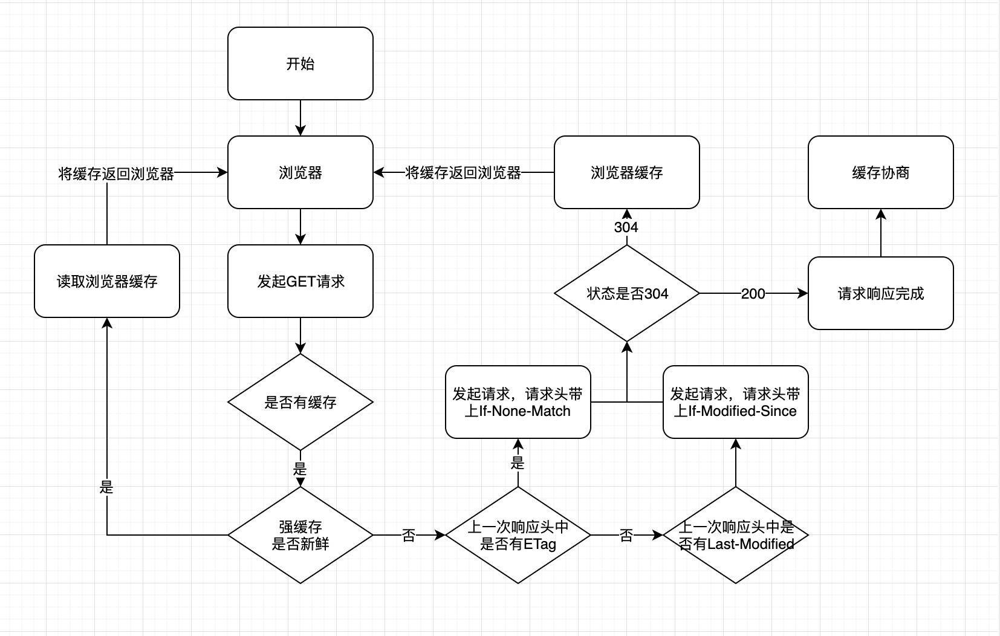

## **HTTP缓存机制**
## 目录
- [前言](#qianyan)
- [强缓存](#qianghc)
- [协商缓存](#xieshanghc)
- [缓存位置](#hcweizhi)
- [用户操作](#operate)

---
### <span id="qianyan">**前言**</span>
&emsp;&emsp;HTTP缓存分为两种，一种是强缓存，另一种是协商缓存。缓存的主要作用是加快资源获取速度，提升用户体验，减少网络传输，缓解服务端压力。具体流程图如下：


- 如果强缓存可用，直接使用
- 否则进入协商缓存，发送HTTP请求，服务器通过请求头中的`If-Modified-Since`或者`If-None-Match`这些条件请求字段检查资源是否更新

    - 若资源更新，返回资源和200状态码
    - 否则返回304，告诉浏览器直接从缓存获取资源
---
### <span id="qianghc">**强缓存**</span>

首先检查的强缓存阶段不需要发送请求，通过相应字段来进行判断。
```
在HTTP/1.0和HTTP/1.1中，使用的字段不相同，1.0时期使用Expires，1.1使用的是Cache-Control
```

1. **Expires**

&emsp;&emsp;Expires的值是一个HTTP日期，及过期时间，时间是相对于服务器的时间而言的，存在于服务端返回的响应头中。当浏览器发起请求时，会根据系统时间和Expires的值进行比较，处在过期时间之前可以直接从缓存里面获取数据，无需再次请求；而系统时间超过Expires的值，缓存将失效。

&emsp;&emsp;**注意**：当系统时间和服务器时间不一致时，比对结果将不准确，因此才会在HTTP/1.1中提出新的字段，而Expires的优先级变得很低（被抛弃）。

2. **Cache-Control**

&emsp;&emsp;Cache-Control是HTTP/1.1中新增的属性，在请求头和响应头中都可以使用，优先级比Expires高。与Expires相比，本质上的差异在于它不是一个具体的时间点，而是一个过期时长，例如常用值max-age如下：
```js
Cache-Control:max-age=3600
```
&emsp;&emsp;它表示的是该响应返回后，在3600秒（一小时）之内可以直接使用缓存。还有其他的属性值可以使用，如下：
- max-age：单位是秒，缓存时间计算的方式是距离发起的时间的秒数

- public：响应可以被中间代理、CDN等缓存。这是因为一个请求可能要经过不同的代理器最后才到达服务器，不仅仅浏览器可以缓存数据，该设置可以让中间节点进行缓存
- private：专用于个人的缓存，中间代理、CDN等不能缓存此响应
- no-cache：不使用强缓存，需要与服务器验证缓存是否新鲜（即发送HTTP请求，进入协商缓存）
- no-store：禁止使用缓存（包括协商缓存），每次都向服务器请求最新资源
- must-revalidate：在缓存过期前可以使用，过期后必须向服务器验证
- s-maxage：与max-age相像，区别在于s-maxage是针对代理服务器的缓存时间

3. **Pragma**

&emsp;&emsp;Pragma只有一个值，就是no-cache，效果与Cache-Control中一致，区别在于优先级最高。

---
### <span id="xieshanghc">**协商缓存**</span>

&emsp;&emsp;强缓存失效或不走强缓存后，浏览器在请求头中设置了ETag（If-None-Match)或者Last-Modified（If-Modified-Since）的时候，会将这两个属性值拿到服务端去验证是否命中协商缓存。若命中，会返回304状态码，加载浏览器缓存，并且响应头会设置ETag或Last-Modified属性。

1. **Last-Modified**

&emsp;&emsp;即最后修改时间。
- 在浏览器第一次给服务器发送请求后，服务器会在响应头中加上这个字段。
- 浏览器接收到后，如果再次请求，会在请求头中携带If-Modified-Since字段，该字段的值就是服务器传来的最后修改时间
- 服务器拿到请求头中的If-Modified-Since后，会与服务器中最后一次修改时间进行比对
- 若请求头中值小于最后修改时间，说明需要更新。于是返回新资源，流程与常规HTTP请求无异
- 若相等，返回304并加载浏览器缓存

2. **Etag**

&emsp;&emsp;Etag是服务器根据当前文件内容生成的一串hash码，用于标识该资源。当服务端文件变化时，它的hash码也会随之改变。
- 服务器通过响应头把这个值给浏览器
- 浏览器接收到后，如果再次请求，会把这个值作为If-None-Match这个字段的内容放到请求头中，发给服务器
- 服务器接收该值后与资源的ETag进行比对
- 若不同，说明需要更新，返回新资源
- 相同返回304，直接使用浏览器缓存

3. **对比**

&emsp;&emsp;精准度上而言，ETag比Last-Modified要好。一是因为编辑资源内容可能没有更改，这样会造成缓存失效；二是Last-Modified的感知单位时间是秒，若一秒内多次改变则无法体现出修改。

&emsp;&emsp;性能上Last-Modified更好，因为只是一个时间节点，不需要根据文件内容生成hash码。

&emsp;&emsp;服务器有限考虑ETag。

---
### <span id="hcweizhi">**缓存位置**</span>

&emsp;&emsp;浏览器中缓存位置一共有四种，按照优先级从高到低排序如下：
- Service Worker
- Memory Cache
- Disk Cache
- Push Cache

---
### <span id='operate'>**用户操作**</span>
用户操作 | Expires / Cache-Control | Last-Modified / ETag
---|---|---
地址栏回车 | 有效 | 有效
页面链接跳转 | 有效 | 有效
新开窗口 | 有效 | 有效
前进后退 | 有效 | 有效
cmd + R | 无效 | 有效
cmd + shift + R | 无效 | 有效

* 普通刷新<br>
    cmd + R普通刷新时，绕过浏览器本地缓存，服务器端的协商缓存生效。
* 强制刷新<br>
    cmd + shift + R强制刷新时，绕过所有缓存，直接让服务器返回最新的资源。
* 回车或转向<br>
    在地址栏输入地址或跳转等操作时，所有缓存都生效。
