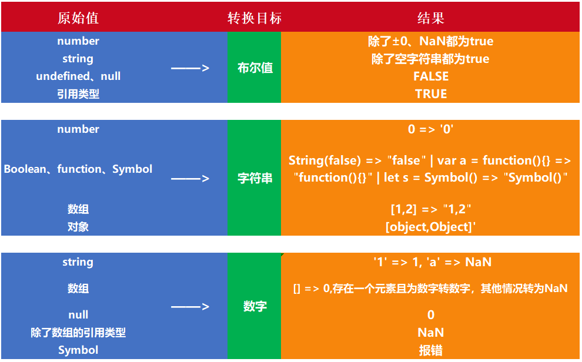

## <span id="history">目录</span>
- [数据类型](#datatype)
- [类型判断](#datajudge)
- [类型转换](#datatransform)
- [间幕：JavaScript内存机制](#somethingelse)
- [浅拷贝](#clone)
- [深拷贝](#deepclone)
- [疑问](#question)

### <span id="datatype">一、数据类型</span>
&emsp;&emsp;JavaScript目前的数据类型有八种，其中七种是基本数据类型，一种引用数据类型——`Object`。数据的存储方式看[这里](#somethingelse)
- undefined
- null
- boolean
- number
- string
- object
- Symbol(es6新增)
- BigInt(es10新增)

1. `undefined`类型只有undefined这一个值，
```js
var uzi;
let xiaohu;
const mlxg; //  这里会直接报错，Missing initializer in const declaration，使用const需要一开始就赋值
//  var letme;
var ming;

//  下列值全部都是undefined
console.log(uzi, xiaohu, letme, ming);

console.log(uzi == ming, uzi === ming);// true, true

//  值得注意的是，letme并没有声明，直接使用会报错，但用typeof却会显示为undefined
console.log(typeof uzi);  //  undefined
console.log(typeof letme);  //  undefined
```

2. `null`类型同样只有null这一个值。从逻辑角度来看，null表示一个**空对象指针**，因此用typeof检测null会返回`object`。由于`undefined`是派生自`null`，因此在判断上会有如下的结果。
```js
const obj = null;
console.log(typeof obj);  //  "object"

console.log(undefined == null, undefined === null); //  true, false
```

**注意：**

&emsp;&emsp;目前而言`undefined`和`null`，null表示“没有对象”，此处不应该有值；undefined表示“缺少值”，此处应该有一个值，但并未定义。
```js
//  null用法
1、作为函数的参数，表示该函数的参数不是对象；
2、作为对象原型链的终点。

//  undefined用法
1、变量被声明但未赋值，此时等于undefined；
2、调用函数，应该传递的参数没有给，该参数就是undefined；
3、对象没有赋值的属性，该属性值为undefined；
4、函数没有返回值时，默认返回的是undefined。
```

3. `boolean`类型只有两个字面值，`true`和`false`，且区分大小写。所有类型的值都可以调用Boolean()函数获取一个Boolean值，返回内容取决于数据类型和实际的值，在某些控制语句中也会自动对内容进行Boolean转换，因此需要掌握具体转换结果，如下表所示：

| 数据类型 | 转换为true的值 | 转换为false的值 |
| --- | ------ | ---- |
| Boolean | true | false |
| String | 任何非空字符串 | ""（空字符串） |
| Number | 任何非零数字 | 0和NaN |
| Object | 任何对象 | null |
| Undefined | n/a或N/A | undefined |

4. `number`类型常见的是十进制，也可以使用八进制和十六进制来表示整数。八进制的数第一位必须是零，假如后面的数值超出了0~7的范围，将忽略开头的0，直接作为十进制来解析。十六进制前两位必须是0x，后面是十六进制数字（0~9及A~F，字母大小写无所谓）
```js
//  八进制
const octalNum1 = 070;  //  八进制的56
const octalNum2 = 079;  //  无效的八进制，解析为79

//  十六进制
const hexNum1 = 0xA;  //  十六进制的10
const hexNum2 = 0x1f; //  十六进制的31
```
&emsp;&emsp;NaN即非数值（not a number），是一个特殊的数值，它用于表示一个本来要返回数值的操作数未返回数值的情况。它有两个特点，一是**涉及NaN的操作都会返回NaN**，在多次计算中可能出现该问题；二是**NaN与任何值包括其自身都不相等**。

5. `string`类型

  &emsp;&emsp;有转义字符需要留心：
| 字面量 | 含义 |
| --- | ------ |
| \n | 换行 |
| \t | 制表 |
| \b | 退格 |
| \r | 回车 |
| \f | 进制 |
| \\ | 斜杠 |
| \' | 单引号 |
| \" | 双引号 |
| \xnn | 以十六进制代码nn表示的一个字符（n为0~F），例如：\x41表示A |
| \unnnn | 以十六进制代码nnn表示的一个Unicode字符，例如：\u03a3表示希腊字符∑ |

6. `object`类型

&emsp;&emsp;object暂时只记录三点关于键名的注意：
- 对象的键名只能是字符串和 Symbol 类型
- 其他类型键名会被转换成字符串类型
- 对象转字符串默认会调用 toString 方法

```js
// example 1
var a={}, b='123', c=123;
a[b]='b';
a[c]='c';
console.log(a[b]);

// example 2
var a={}, b=Symbol('123'), c=Symbol('123');
a[b]='b';
a[c]='c';
console.log(a[b]);

// example 3
var a={}, b={key:'123'}, c={key:'456'};
a[b]='b';
a[c]='c';
console.log(a[b]);
```

&emsp;&emsp;结果为 c、b、c。第一个为c，是因为被转换为字符串后，都是'123'；第二个为b，是因为Symbol类型可以作为键名，因此两个都不同；第三个是c，因为对象转换为字符串后，都是[object, Object]，所以又被覆盖了。

7. `Symbol`类型

&emsp;&emsp;`Symbol`类型表示独一无二的值。它通过 `Symbol` 函数生成。对象使用 `Symbol` 属性名的类型，可以保证不会跟其他属性名冲突。但需要注意的是，<font color="red">**Symbol作为属性名时，不能用点运算符。**</font>这是会因为点运算符后面总是字符串，所以不会读取 `Symbol` 作为标识名所指代的那个值，导致实际上属性名是个字符串。

&emsp;&emsp;所以在手写 call、apply、bind 的时候使用的 Symbol 值需要用 `obj[Symbol]` 来执行对应的函数。

&emsp;&emsp;`Symbol` 作为属性名，遍历对象的时候，该属性不会出现在 `for...in`、`for...of` 循环中，也不会被 `Object.keys()、Object.getOwnPropertyNames()、JSON.stringfy()`返回。

&emsp;&emsp;但它也不是私有属性，有一个 `Object.getOwnPropertySymbols()` 方法，可以获取指定对象的所有 `Symbol` 属性名，该方法返回一个数组，成员是当前对象的所有用作属性名的 `Symbol` 值。

### <span id="datajudge">二、类型的判断</span>

&emsp;&emsp;首先说说 **typeof** 操作符。对一个值使用`typeof`可以获得如下字符串：

- 未定义值时——undefined
- 布尔值——boolean
- 字符串——string
- 数值——number
- 对象或者null——object
- 函数——function

&emsp;&emsp;Object的判断需要使用 **Object.prototype.toString()**

&emsp;&emsp;当 toString 方法被调用的时候，下面的步骤会被执行：
如果 this 值是 undefined，就返回 [object Undefined]
如果 this 的值是 null，就返回 [object Null]
让 O 成为 ToObject(this) 的结果
让 class 成为 O 的内部属性 [[Class]] 的值
最后返回由 "[object " 和 class 和 "]" 三个部分组成的字符串

```js
// 以下是11种：
var number = 1;          // [object Number]
var string = '123';      // [object String]
var boolean = true;      // [object Boolean]
var und = undefined;     // [object Undefined]
var nul = null;          // [object Null]
var obj = {a: 1}         // [object Object]
var array = [1, 2, 3];   // [object Array]
var date = new Date();   // [object Date]
var error = new Error(); // [object Error]
var reg = /a/g;          // [object RegExp]
var func = function a(){}; // [object Function]

function checkType() {
    for (var i = 0; i < arguments.length; i++) {
        console.log(Object.prototype.toString.call(arguments[i]))
    }
}

checkType(number, string, boolean, und, nul, obj, array, date, error, reg, func)

console.log(Object.prototype.toString.call(Math)); // [object Math]
console.log(Object.prototype.toString.call(JSON)); // [object JSON]

function a() {
    console.log(Object.prototype.toString.call(arguments)); // [object Arguments]
}
a();
```

&emsp;&emsp;**instanceof** 运算符用于检测构造函数的prototype属性是否出现在某个实例对象的原型链上。语法为`object instanceof constructor`。

```js
function Car(make, model, year) {
  this.make = make;
  this.model = model;
  this.year = year;
}
const auto = new Car('Honda', 'Accord', 1998);

const test = {};

console.log(auto instanceof Car, test instanceof Car);
// expected output: true false

console.log(auto instanceof Object, test instanceof Object);
// expected output: true true
```

### <span id="datatransform">三、类型的转换</span>

1. 转布尔值直接使用`Boolean()`即可

| 数据类型 | 转换为true的值 | 转换为false的值 |
| --- | ------ | ---- |
| Boolean | true | false |
| String | 任何非空字符串 | ""（空字符串） |
| Number | 任何非零数字 | 0和NaN |
| Object | 任何对象 | null |
| Undefined | n/a或N/A | undefined |

2. 转数字用`Number()`、`parseInt()`或`parseFloat()`。

3. 转字符串用`String()`或者`toString()`。需要注意的是，**null和undefined没有`toString`方法**。<font color="red">注意：数字直接调用 `1.toString()` 会报错，因为 `1.`会被理解为小数点而非调用函数，所以要想使用，需要这样多加一个点 `1..toString()` 、中间加空格 `1 .toString()` 或者用括号 `(1).toString()` 才能达成数字转字符串的目的。</font>

4. 一元加号会尝试将 `boolean` 类型转换为数字类型，所以 `+true` 会被转换为 1，而 `+false` 被转换为0



### <span id="somethingelse">间幕一</span>
&emsp;&emsp;讲JavaScript的拷贝之前需要了解一下JavaScript的数据存储机制。
&emsp;&emsp;JavaScript的存储空间分为栈(stack)、堆(heap)和池(一般也归类为栈)，其中栈存放变量，堆存放复杂对象，池存放常量。基础数据类型都有固定大小，它们由系统自动分配空间，可以直接操作保存在栈内存空间的值，因此**基础数据类型都是按值来访问的**；引用数据类型的大小不固定，他们的值是保存在堆内存中的对象，JavaScript不允许直接访问堆内存中的位置，在操作对象时我们是在操作对象的引用，因此**引用类型的值是按照引用访问的**，可以理解为对象的地址指针。

### <span id="clone">四、浅拷贝</span>
&emsp;&emsp;根据以上分析可知，深浅拷贝是针对引用数据类型而言的，浅拷贝的如果是引用类型，拷贝的就是其内存地址，所以**如果其中一个对象改变了这个地址，就会影响到另一个对象**；深拷贝是将一个对象从内存中完整的拷贝一份出来，从堆内存中开辟一个新的区域存放新对象，**且修改新对象不会影响原对象**

&emsp;&emsp;接下来介绍常见的赋值语句中属于浅拷贝的例子。

1. Object.assign()

&emsp;&emsp;Object.assign() 方法可以把任意多个的源对象自身的可枚举属性拷贝给目标对象，然后返回目标对象。用法如下：
```js
const obj1 = {
    person: {
        name: "kobe",
        age: 41,
    },
    sports:'basketball',
};
const obj2 = Object.assign({}, obj1);

obj2.person.name = "wade";
obj2.sports = 'football'

console.log(obj1); // { person: { name: 'wade', age: 41 }, sports: 'basketball' }
```

2. lodash的clone方法

```js
import lodash from 'lodash';

const obj1 = {
    a: 1,
    b: { f: { g: 1 } },
    c: [1, 2, 3]
};

const obj2 = lodash.clone(obj1);
console.log(obj1.b.f === obj2.b.f);// true
```
3. 展开运算符

```js
const obj1 = {
    name: 'Kobe',
    address: {
        x:100,
        y:100,
    },
};
const obj2 = {...obj1};

obj1.address.x = 200;
obj1.name = 'wade';

console.log('obj2',obj2) // obj2 { name: 'Kobe', address: { x: 200, y: 100 } }
```

4. Array.prototype.concat()

```js
const arr1 = [1, 3, {username: 'kobe'}];
const arr2 = arr1.concat();

arr2[2].username = 'wade';

console.log(arr1); //[ 1, 3, { username: 'wade' } ]
```
5. Array.prototype.slice()
```js
const arr = [1, 3, {username: ' kobe'}];
const arr3 = arr.slice();

arr3[2].username = 'wade';

console.log(arr); // [ 1, 3, { username: 'wade' } ]
```

### <span id="deepclone">五、深拷贝</span>
1. JSON.parse(JSON.stringify())

&emsp;&emsp;这个方式利用了JSON.stringify将对象转换为JSON字符串，再用JSON.parse() 把字符串解析为对象，这个过程中新对象产生，于是实现深拷贝。

&emsp;&emsp;**这个方法无法处理函数和正则**，经过处理后正则会变为空对象，函数变为null。

2. lodash.cloneDeep()


3. 手写递归

&emsp;&emsp;网上一堆，建议多看看。


### <span id="question">疑问</span>

1. 直接赋值对于对象和数组而言，到底是浅拷贝还是深拷贝？

| 方式 | 和原数据是否指向同一对象 | 第一层数据为基本数据类型 | 原数据中包含子对象
| --- | ------ | ---- | ----
| 赋值 | 是 | 改变会使原数据一同改变 | 改变会使原数据一同改变
| 浅拷贝 | 否 | 改变**不**会使原数据一同改变 | 改变会使原数据一同改变
| 深拷贝 | 否 | 改变**不**会使原数据一同改变 | 改变**不**会使原数据一同改变

举例说明吧：
```js
const obj1 = {
    name: 'caisiqi',
    age: 16,
    favorite: ['basketball', 'music', 'anime', 'comic', 'games'],
    lovers: [{name: '凉宫春日', age: 16}, {name: '雪之下雪乃', age: 16}],
}

const obj2 = obj1;  //  obj2的则仅仅是一个指针而已

const obj3 = {...obj1}; //  obj3的name和age属性与obj1是两个地方存储的

const obj4 = JSON.parse(JSON.stringify(obj1));

obj2.age = 24;
obj2.favorite.push('novel');

console.log(obj1.age, obj1.favorite);   //  24, ['basketball', 'music', 'anime', 'comic', 'games', 'novel']

obj3.age = 20;
obj3.favorite.push('eat');

console.log(obj1.age, obj1.favorite);   //  24, ['basketball', 'music', 'anime', 'comic', 'games', 'novel', 'eat']
```

2. React使用过程中用同一state稍作修改后setState时是否需要拷贝？拷贝是深还是浅？（在线编辑实验手册以及某个studentList的地方碰到过类似问题）

&emsp;&emsp;假如新的state是根据旧state处理得来，那么应该在setState的传参中使用函数，在函数中进行处理，而不是拿到state后处理完毕再setState一个对象。
