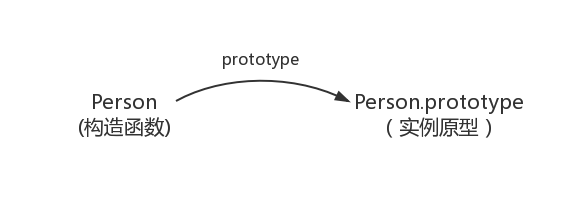

## **简单一句话**

&emsp;&emsp;原型、构造函数和实例的关系：`原型`通过`构造函数`生成`实例`。

---
## **构造函数创建实例**
```js
function Person() {
  this.name = ' caisiqi';
  this.age = 16;
}

const person = new Person();  //  person.name === 'caisiqi person.age === 16
```
---
## **prototype**
&emsp;&emsp;每个函数都有一个prototype属性，指向将该函数作为构造函数而创建的实例对象的原型。新生成的对象会从原型继承属性。（继承严格来说是复制操作，但这里并不是复制，实例与原型只是有一个属性的关联而已，可以理解为实例”继承“的某个属性是一个指针，指向的是原型的对应属性）



---
## **\_\_proto\_\_**
&emsp;&emsp;__proto__是除了null以外所有对象都有的一个属性，指向对象的原型。
```js
person.__proto__ === Person.prototype
```


<font color="red">**注意**</font>

`__ptoto__` 并不是语言本身的特性，这是各大厂商具体实现时添加的私有属性，不建议在生产中使用该属性，避免对环境产生依赖。生产环境中，可以使用 `Object.getProtoypeOf` 来获取实例对象的原型，然后再为原型添加方法、属性。

---
## **constructor**
&emsp;&emsp;每个原型都有一个constructor属性，指向关联的构造函数
```js
Person = Person.prototype.constructor
```


---
## **原型链**

&emsp;&emsp;由上述内容可知，构造函数的`prototype`指向原型，实例的`__proto__`指向原型，原型的`constructor`指向构造函数（实例的`constructor`也指向构造函数，是因为实例并没有`constructor`属性，于是从原型中找，所以会有  `实例.construcotr === 构造函数.prototype.constructor`）


&emsp;&emsp;原型是一个对象，那原型的原型也是对象，顺着找下去关系就如下所示，蓝色的线即为原型链：


&emsp;&emsp;`Object.getPrototypeOf()`方法返回指定对象的原型（内部[[Prototype]]属性的值）

---
## **Function和Object的关系**

- `Object.prototype`是所有对象的根源
- `Object.prototype`只是挂在在`Object`上
- `Function.prototype`构造自`Object.prototype`，所以有：
```js
Function.prototype.__proto__ === Object.prototype
```
- `Function.prototype`同样只是挂在在`Function`函数对象上
- `Object`函数和`Function`都构造自`Function.prototype`
- `Function`函数和其他函数都由`Function.prototype`构造而成
- `Function.prototype`和`Function.__proto__`相同

&emsp;&emsp;总之一句话，先有`Object.prototype`，再有了`Function.prototype`，才有了`Function`和`Object`对象。
