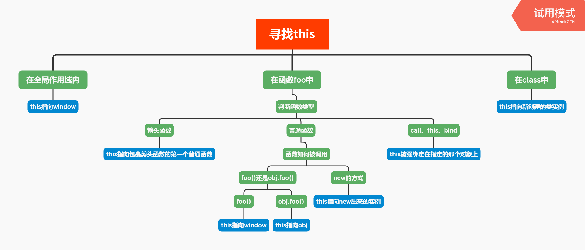

## **目录**
- [前言](#forward)
- [执行上下文栈](#stack)
- [变量对象](#vo)
- [作用域链](#scope)
- [this](#this)
- [闭包](#difficult)
- [番外——词法作用域](#other)


---
## <span id="forward">**前言**</span>

&emsp;&emsp;当JavaScript执行一段可执行代码(executable code)时，会创建对应的执行上下文，

&emsp;&emsp;每个执行上下文，都有三个重要属性：
- 变量对象(Variable object,VO)
- 作用域链(Scope chain)
- this

&emsp;&emsp;作用域决定了代码区块中变量和其他资源的可见性。作用域最大额用处就是隔离变量，不同作用域下同名变量不会有冲突。

&emsp;&emsp;ES6之前 JavaScript 没有块级作用域，只有全局作用域和函数作用域。

&emsp;&emsp;**执行上下文在运行时确定，随时可能改变；作用域在定义时就确定，并且不会改变。**

---
## <span id="stack">**执行上下文栈**</span>

&emsp;&emsp;JavaScript创建了执行上下文栈(Execution context stack，ECS)来管理执行上下文。

&emsp;&emsp;此处模拟一下执行上下文栈的工作过程。先定义它是一个数组，当JavaScript开始解释执行代码的时候，最先遇到全局代码，此时向其中压入一个全局执行上下文，之后再遇到函数，会创建一个执行上下文，并压入执行上下文栈，执行完毕后将函数的执行上下文再弹出。下面给出一个例子：
```js
//  定义
ECStack = [];

//  压入全局执行上下文
ECStack = [
  globalContext,
];

function func3() {
  console.log(3);
}

function func2(){
  func3();
}

function func1() {
  func2();
}

//  func1()
ECStack.push(func1Context);

//  发现func1调用了func2，因此func2()
ECStack.push(func2Context);

//  而func2还调用了func3，只好再func3()
ECStack.push(func3Context);

//  func3执行完毕
ECStack.pop();

//  func2执行完毕
ECStack.pop();

//  func1执行完毕
ECStack.pop();
```
---
## <span id="vo">**执行上下文——变量对象**</span>

执行上下文的代码分成两个阶段进行处理，分析和执行，也可以分为：
1. 进入执行上下文
2. 代码执行

进入执行上下文，此时还没有执行代码，变量对象包括有
1. 函数所有形参(如果是函数上下文)
    - 由名称和对应值组成的一个变量对象的属性被创建
    - 没有实参，属性值设为 `undefined`
2. 函数声明
    - 由名称和对应值（函数对象 `function-object`）组成一个变量对象的属性被创建
    - 如果变量对象已经存在相同名称的属性，则完全 **替换** 这个属性
3. 变量声明
    - 由名称和对应值（`undefined`）组成一个变量对象的属性被创建
    - 如果变量名称跟已经声明的形式参数或函数相同，则变量声明 **不会干扰已经存在的这类属性**
4. 注意：函数提升优先级比变量提升高，且不会被变量声明覆盖，但是会被变量赋值覆盖，也会被后面的同名函数替换（例子请看下方红色注意代码部分）

举个例子：
```js
function foo(a) {
  var b = 2;
  function c() {};
  var d = function() {};

  b = 3;
}

foo(1);
```
进入执行上下文后，此时的AO是：
```js
AO = {
  arguments: {
    0: 1,
    length: 1,
  },
  a: 1,
  b: undefined,
  c: reference to function c(){},
  d: undefined
}
```
### 代码执行阶段顺序执行，修改变量对象，上例执行完后如下：
```js
AO = {
  arguments: {
    0: 1,
    length: 1,
  },
  a: 1,
  b: 3,
  c: reference to function c(){},
  d: reference to FunctionExpression "d"
}
```

### <font color="red">**注意**</font>
```js
//  第一段
console.log(Foo); //  f Foo() {console.log(1)}
function Foo() {
  console.log(1);
}

console.log(Foo); //  f Foo() {console.log(1)}

var Foo = function() {
  console.log(2);
}

console.log(Foo); //  f Foo() {console.log(2)}

//  第二段
console.log(Foo); //  f Foo() {console.log(1)}

var Foo = function() {
  console.log(2);
}

console.log(Foo); //  f Foo() {console.log(2)}

function Foo() {
  console.log(1);
}

console.log(Foo); //  f Foo() {console.log(2)}

//  第三段
console.log(Foo); //  f Foo() {console.log(1)}

function Foo() {
  console.log(1);
}

console.log(Foo); //  f Foo() {console.log(1)}

var Foo = 2;

console.log(Foo); //  2

//  第四段
console.log(Foo); //  f Foo() {console.log(1)}

var Foo = 2;

console.log(Foo); //  2

function Foo() {
  console.log(1);
}

console.log(Foo); //  2
```

### **总结**
1. 全局上下文的变量对象初始化是全局对象
2. 函数上下文的变量对象初始化只包括Arguments对象
3. 在进入执行上下文时会给变量对象添加形参、函数声明、变量声明等初始的属性值
4. 代码执行阶段会再次修改变量对象的属性值
5. (**补充说明**)函数名如果跟用var声明的变量名相同，不赋值的情况下打印变量名会显示为函数，赋值的话那么最终结果会是用var声明的变量

---
## <span id='scope'>**作用域链**</span>

&emsp;&emsp;当查找变量时，会从当前上下文的**变量对象**中查找，如果没有找到就会从父级执行上下文的**变量对象**中查找。这样**由多个执行上下文的变量对象构成的链表就叫作用域链**。

### **函数创建时**
&emsp;&emsp;函数有一个内部属性[[scope]]，当函数创建的时候，就会保存所有父变量对象到其中，可以理解[[scope]]就是所有父变量对象的层级链，但[[scope]]并不代表完整的作用域链。
```js
function foo() {
  function bar() {
    //  some code
  }
}

//  创建时，各自的[[scope]]为
foo.[[scope]] = [
  globalContext.VO,
];
bar.[[scope]] = [
  fooContext.AO,
  globalContext.VO,
];
```
### **函数激活**
&emsp;&emsp;当函数激活时，进入函数上下文，创建了函数的变量对象（活动对象）后，将其添加到作用链（即所有父变量对象的层级链）的前端，此时才构成一个完整的执行上下文作用域链，结构如下：
```js
Scope = [AO].concat([[scope]]);
```

&emsp;&emsp;可以这样理解，**执行上下文中的作用域scope**是由函数的[[scope]]属性初始化的，而函数的[[scope]]属性保存的是函数创建时词法层面上的父级们的VO（变量对象）的引用，**跟函数的执行顺序无关**。

---
## <span id='this'>**this**</span>

[this](https://github.com/mqyqingfeng/Blog/issues/7)

[箭头函数this](https://es6.ruanyifeng.com/#docs/function#%E7%AE%AD%E5%A4%B4%E5%87%BD%E6%95%B0)

&emsp;&emsp;this的指向需要关注的是函数执行的括号前面到底是什么东西。

&emsp;&emsp;非严格模式下this的值为undefined时，会被隐式转换为全局对象。

&emsp;&emsp;简单来说
- 普通函数中在函数被调用时决定，永远指向调用他的那个对象；
- 箭头函数中在函数被定义时决定，因为箭头函数不会创建 this，所以只能从作用域链的上一层继承。



### **几个题目**
```js
function Foo() {
  getName = function() {
    console.log(1);
  };

  return this;
}

function getName() {
  console.log(5);
}

Foo().getName();  //  ?
```
```js
function Foo() {
  getName = function() {
    console.log(1);
  };

  return this;
}

Foo.prototype.getName = function() {
  console.log(3);
}

function getName() {
  console.log(5);
}

new Foo().getName();  //  ?
```
---
## <span id='difficult'>**闭包**</span>

&emsp;&emsp;闭包就是能够访问自由变量的**函数**。

&emsp;&emsp;自由变量是指在函数中使用的，但既不是函数参数也不是函数的局部变量的变量。换句话说，**闭包是指有权访问另一个函数作用域内变量的函数**。

简单例子：
```js
var a = 1;

function foo() {
  console.log(a);
}

foo();
```
&emsp;&emsp;`foo` + `a` 就构成了一个闭包。从技术角度来说，所有的JavaScript函数都是闭包，因为它们都在创建的时候就将上层上下文的数据保存下来了，哪怕是简单的全局变量也是如此，因为函数中访问全局变量就相当于访问自由变量，这个时候使用最外层的作用域。

&emsp;&emsp;但实践上的闭包，指的是以下函数：
1. 即使创建它的上下文已经销毁，它依然存在（比如，内部函数从父函数中返回）
2. 在代码中引用了自由变量
```js
var scope = "global scope";

function checkscope() {
  var scope = "local scope";

  function f() {
    return scope;
  }

  return f;
}

var foo = checkscope();
foo();
```
---
## <span id='other'>**番外——词法作用域**</span>

```js
var fn = null;
function foo() {
    var a = 2;
    function innnerFoo() {
        console.log(c);
        console.log(a);
    }
    fn = innnerFoo;
}

function bar() {
    var c = 100;
    fn();
}

foo();
bar();  //  ? ?
```
```js
var value = 1;

function foo() {
    console.log(value);
}

function bar() {
    var value = 2;
    foo();
}

bar();  //  ?
```
