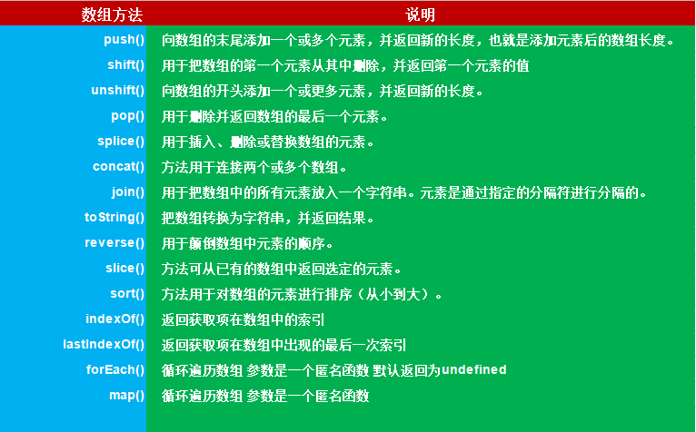
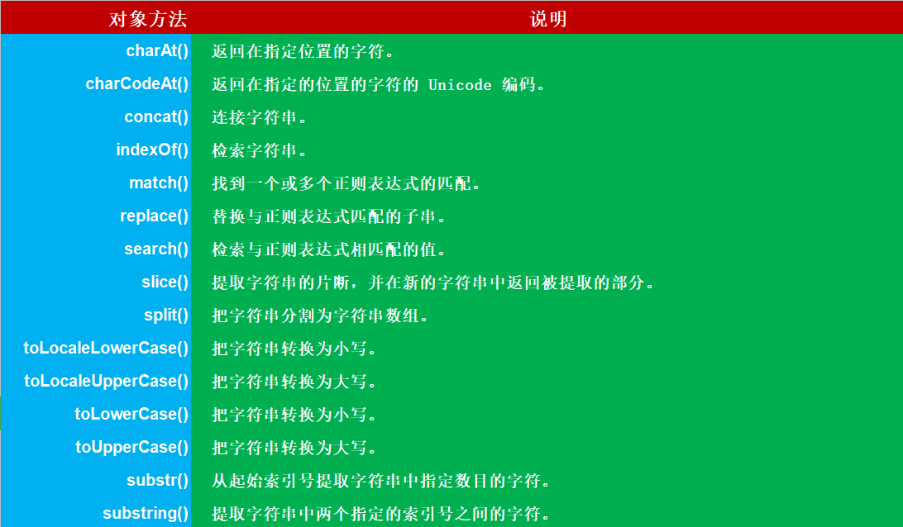

# Array、String常用方法

## 目录
- [](#)
- [](#)
- [](#)

## 一、上图




## 二、开始

### 1、map、forEach

&emsp;&emsp;这两兄弟放一起来讲。它们都是用于遍历数组，前者会返回一个新数组，新数组中的值是目标数组中对应的值经过一个回调函数处理过后的返回值。日常工作中最常见的就是后端返回一个数组，前端将这个数组再加工，最后渲染、使用。MDN上的语法如下：
```js
const newArray = arr.map(function callback(currentValue[, index[, array]]) {
 // Return element for new_array
}[, thisArg])
```
例如：
```js
const a = [1, 2, 3];

const b = a.map((item) => (item + 1));  //  b = [2, 3, 4];
```
&emsp;&emsp;假如不需要返回值，仅仅只是处理每一项的数据，使用`forEach`便足矣，其语法如下：
```js
arr.forEach(callback(currentValue [, index [, array]])[, thisArg])

const a = [1, 2];
const b = [];
a.forEach((item) => {
  if (item === 1) {
    b.push(item);
  }
  console.log(item);
});
```
### 2、every、some
&emsp;&emsp;这两个函数的作用是检测数组中的元素是否能通过传入函数的测试，区别在于`every`需要全部通过，`some`只要有一个能通过都行，两者都会返回一个`Boolean`类型的值。使用语法如下：
```js
arr.every(callback[, thisArg])

arr.some(callback(element[, index[, array]])[, thisArg])
```
&emsp;&emsp;**但有一点需要注意，当数组为空数组时，every一定返回`true`，而`some`一定返回`false`。**

### 3、find、findIndex、filter
&emsp;&emsp;这三个函数都用于筛选，`find`返回满足筛选条件的第一个值，没有则返回`undefined`，`findIndex`顾名思义是返回其`index`或者`undefined`；而`filter`会返回一个由通过测试的所有元素组成的新数组，具体语法如下；
```js
arr.find(callback[, thisArg])

arr.findIndex(callback[, thisArg])

const newArray = arr.filter(callback(element[, index[, array]])[, thisArg])
```
### 4、concat、slice
&emsp;&emsp;前者可以拼接多个数组为一个数组，后者会浅拷贝数组的某个片段，两者都是返回新的结果，并不会修改原数组。

&emsp;&emsp;**需要注意，`slice`的提取会包含begin但不包含end的元素。**
如果begin为负数，则表示从原数组中的倒数第几个元素开始提取，如果 begin 大于原数组的长度，则会返回空数组；如果end为负数， 则它表示在原数组中的倒数第几个元素结束提取，如果 end 被省略，则 slice 会一直提取到原数组末尾。
```js
const new_array = old_array.concat(value1[, value2[, ...[, valueN]]])

const newArr = arr.slice([begin[, end]])
```

### 5、sort、splice
&emsp;&emsp;`sort`顾名思义为排序，原数组经过排序后会被修改，其语法如下：
```js
arr.sort([compareFunction])
/*
  compareFunction有两个参数
  其一为firstEl，其二为secondEl
  不传compareFunction将会把元素转换为字符串比较UTF-16顺序
*/
//  示例：
const a = [{name: 'Curry', age: 32}, {name: 'James', age: 34}, {name: 'Zion', age: 20}];

a.sort((firstEl, secondEl) => firstEl.age - secondEl.age)
```

### 6、flat
&emsp;&emsp;flat可以将多维数组扁平化，并将扁平化后的结果返回，需要注意的是数组中的空项会被剔除。其语法如下：
```js
//  depth可以为Infinity，即展开任意深度
const newArray = arr.flat([depth])
```
