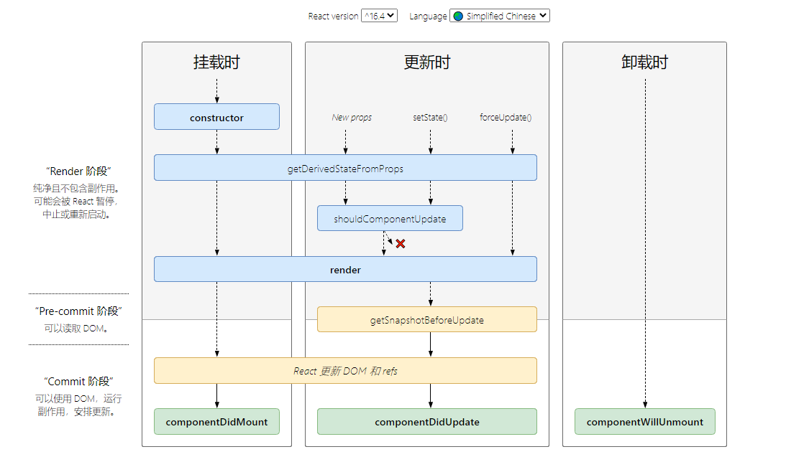

&emsp;&emsp;生命周期分为了三个阶段，分别是挂载阶段、更新阶段、卸载阶段。

React 16之后有三个生命周期被废弃（但未删除）
- componentWillMount
- componentWillReceiveProps
- componentWillUpdate

- 挂载阶段
  - constructor：构造函数
  - getDerivedStateFromProps
  - render
  - componentDidMount
- 更新阶段
  - getDerivedStateFromProps
  - shouldComponentUpdate
  - render
  - getSnapshotBeforeUpdate
  - componentDidUpdate
- 卸载阶段
  - componentWillUnmount

以下是旧版的对比

