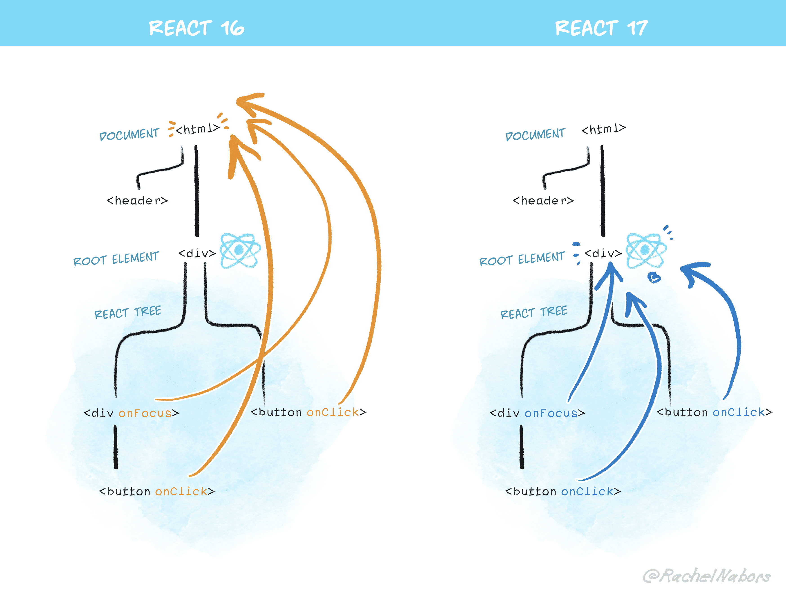

## React 17 更新

### 简述

&emsp;&emsp;React 17 针对开发者暂无新特性。React 17 被当作后续版本的基石，为了使不同版本的 React 相互嵌套更为容易。

[React 17 发布的博文](https://zh-hans.reactjs.org/blog/2020/10/20/react-v17.html)

### 事件委托的变更

&emsp;&emsp;虽说没啥针对开发者的新特性，但没有变化就不必迭代出一个新版本。其中之一就是 React 时间系统的修改。

&emsp;&emsp;在React 17 中，React 不会再将事件处理添加到 `document` 上，而是将事件处理添加到渲染 React 树的根 DOM 容器中：

```javascript
const rootNode = document.getElementById('root');

ReactDOM.render(<App />, rootNode);
```

&emsp;&emsp;在React 16 及之前版本中，React 会对大多数事件进行 `document.addEventListener()` 操作。React 17 开始会通过调用 `rootNode.addEventListener()` 来代替。



### JSX 转换

&emsp;&emsp;浏览器中无法直接使用 JSX，所以开发者需要依靠 Babel 或 TypeScript 来将 JSX 代码转换为 JavaScript 代码。

&emsp;&emsp;有个经典的问题是，“为什么使用 React 会需要在文件中 import React from 'react' ？”。因为将 JSX 代码转换为 JavaScript 代码，会调用 `React.createElement()` 函数。

```javascript
import React from 'react';

function App() {
    return <h1>use react</h1>;
}

//	转换为
import React from 'react';

function App() {
    return React.createElement('h1', null, 'use react');
}
```

&emsp;&emsp;但这种方式存在有如下问题：

1. 要想使用 JSX，就需要在 React 的环境下；
2. 有一些 `React.createElement` 无法做到的[性能优化和简化](https://github.com/reactjs/rfcs/blob/createlement-rfc/text/0000-create-element-changes.md#motivation)。

&emsp;&emsp;为了解决这些问题，React 17 在 React 的 package 中引入两个新入口，这些入口只会被 Babel、TypeScript 等编译器使用。新的 JSX 转换不会将 JSX 转换为 `React.createElement`，而是自动从 React 的 package 中引入新的入口函数并调用。

```javascript
//	由编译器引入，禁止自己引入
import { jsx as _jsx } from 'react/jsx-runtime';

function App() {
    return _jsx('h1', { children: 'use react' });
}
```

&emsp;&emsp;那么此时无需引入 React 即可使用 JSX（倘若不使用 Hooks 等其他内容）。可查看[官方文档](https://github.com/reactjs/rfcs/blob/createlement-rfc/text/0000-create-element-changes.md#detailed-design)了解全新转换工作的具体细节。

&emsp;&emsp;需要注意的是，开发者如果想在代码中手动创建元素，可以继续使用 `React.createElement`，但不能使用 `react/jsx-runtime` 和 `react/jsx-dev-runtime`，它们只能由编译器转换使用。