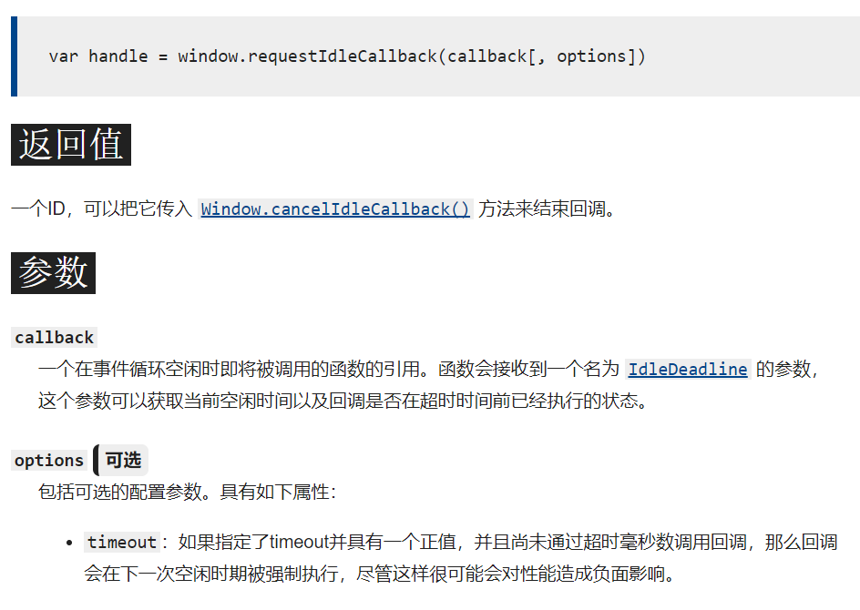
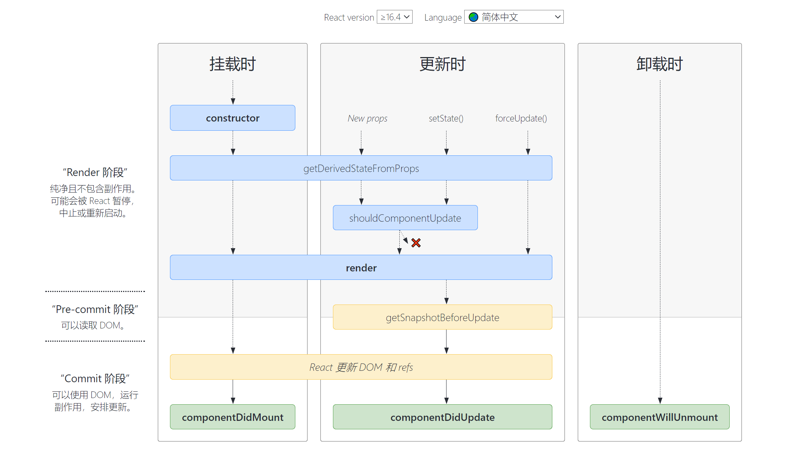

# React Fiber

### 前言

&emsp;&emsp;Fiber 是 React 操作 Virtual DOM 前后对比得出需要更新的部分，再去操作真实 DOM 的过程所使用的算法。React 版本16之前的旧算法称为 Stack Reconciler，16之后编写的新算法就叫做 Fiber Reconciler。

&emsp;&emsp;之所以要新写 Fiber，就是因为旧版会有卡顿的现象。卡顿的原因有两个：

1. stack reconciler 采用自顶向下递归，从根组件或 `setState` 后的组件开始，更新整个子树。而递归是无法打断的，如果更新量过大，消耗的时间就会随之增加；
2. 浏览器的渲染线程和 JavaScript 线程是互斥的，所以 JavaScript 线程占据大量时间会让渲染被阻塞。

**小提示**：常规屏幕刷新频率是 60 Hz，如果 JavaScript 线程花大量时间，导致实际刷新频率不到 60 Hz，用户就会感到卡顿。

&emsp;&emsp;因此，reconciliation（调和） 的过程需要考虑如下问题：

1. 并不是所有的 state 更新都需要立即显示出来，比如屏幕以外的部分；
2. 并不是所有的更新优先级都相同，例如用户输入的响应优先级比通过请求填充内容的响应优先级更高；
3. 某些情况下，高优先级的操作应该要能够打断低优先级的操作执行。

### 浏览器的应对

&emsp;&emsp;抛开 React Reconciliation 过程卡顿的情况，浏览器自身发展过程中也更新了一些措施来应对：

- requestAnimationFrame
- requestIdleCallback
- web worker
- IntersectionObserver

&emsp;&emsp;它们分别称为浏览器层面的帧数控制调用、闲时调用、多线程调用、进入可视区调用。

&emsp;&emsp;`requestAnimationFrame`在动画中经常用到；

&emsp;&emsp;`requestIdleCallback`用法：

&emsp;&emsp;不过 `React` 为了照顾大多数浏览器，自己实现了一个 `requestIdleCallback`。

### Fiber

&emsp;&emsp;由之前的分析可以知道，React 16 之前的调度方式为栈，它的问题是不能随意 break、continue，而我们想要在 break 后重新执行，最合适这种场景的数据结构是链表。

&emsp;&emsp;链表对异步友好，它在循环时不用每次都进入递归函数，重新生成执行上下文、变量对象、激活对象，性能当然就比递归要好。因此 React 16 将组件的递归更新，改为链表的依次执行。如果页面有多个虚拟 DOM 树，那么就将它们的根保存到一个数组中。

&emsp;&emsp;在源码中，React 这个纯视图库是三层架构。在 React 15 有：

-  `虚拟 DOM 层`：负责描述结构与逻辑；
- `内部组件层`：负责组件的更新，`ReactDOM.render`、`setState`、`forceUpdate`都是跟它打交道，能多次 setState 只执行一次真实的渲染，在合适的时机执行你的组件实例的生命周期钩子；
- `底层渲染曾`：面对不同显示介质使用不同的渲染方法，例如：浏览器端使用元素节点、文本节点，在Native端调用 oc，Java的GUI，在 canvas 中调用专门的 api 方法。

&emsp;&emsp;虚拟 DOM 是由 JSX 转译过来的，JSX 的入口函数是 `React.createElement`，可操作空间不大；第三层的底层 api 也非常稳定，因此可操作的地方只有第二层——内部组件层。

&emsp;&emsp;React 16 将内部组件层改成了 `Fiber` 这种数据结构，它是一个对象。`Fiber`节点结构中最基本的有 `return`、`child`、`sibling`，分别对应的是父节点、第一个子节点、右边的兄弟节点。通过使用 `Fiber`，对 ReactElement 进行处理，将之前简单的树结构，变成了基于单链表的树结构。

### 生命周期更新的原因

&emsp;&emsp;React 将虚拟 DOM 更新过程分为了两个阶段，`reconciliation`阶段和`commit`阶段，前者可以中断，而后者不可中断，16版本针对生命周期进行了更新，就是因为reconciliation阶段对`Fiber`处理流程的更新。

&emsp;&emsp;在`reconciliation`阶段主要做了以下几件事：

1. 更新 state 和 props
2. 调用生命周期钩子
3. 父级组件中通过 render 方法，获取子组件（类组件），函数组件则直接调用获取
4. diff，将得到的子组件与之前已经渲染的组件对比
5. 计算出需要更新的 DOM

### 过程

&emsp;&emsp;页面渲染完成后，会初始化一个 fiber-tree，初始化 fiber-tree 和初始化 Virtual DOM tree 没什么区别，与此同时，React 还会维护一个 workInProgressTree 用于计算更新，完成 `reconciliation`过程。