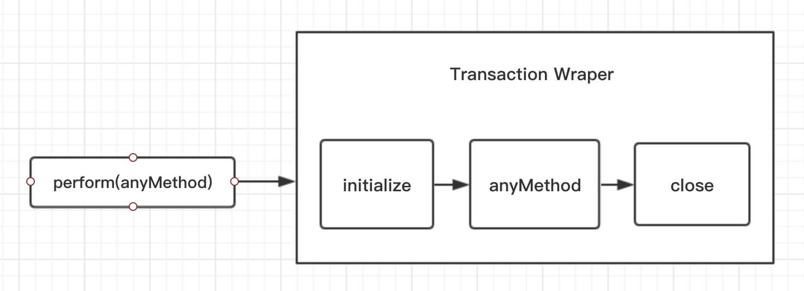

## setState

[组件状态](https://zh-hans.reactjs.org/docs/faq-state.html)

[React.Component](https://zh-hans.reactjs.org/docs/react-component.html#setstate)

[好评论](https://stackoverflow.com/questions/48563650/does-react-keep-the-order-for-state-updates/48610973#48610973)

[另一个](https://github.com/facebook/react/issues/11527#issuecomment-360199710)

[深入解析的文章](https://juejin.cn/post/6844903636749778958)

问结果是如何？
```js
  componentDidMount() {
    this.setState({ val: this.state.val + 1 });
    console.log(this.state.val); // 第 1 次 log

    this.setState({ val: this.state.val + 1 });
    console.log(this.state.val); // 第 2 次 log

    setTimeout(() => {
      this.setState({ val: this.state.val + 1 });
      console.log(this.state.val); // 第 3 次 log

      this.setState({ val: this.state.val + 1 });
      console.log(this.state.val); // 第 4 次 log
    }, 0);
  }
```
&emsp;&emsp;首先需要明白，`setState` 并不是异步的，因为其批处理机制给人一种异步的假象。

&emsp;&emsp;如果是由 `React` 引发的事件处理（例如通过 onClick 引发的，或者是生命周期函数中），调用 `setState` 不会同步更新 `this.state`，除此之外的 `setState` 调用会同步执行 `this.state`。

结果:
```js
//  0 0 2 3
```
再问执行结果：
```js
class Test extends React.Component {

  state = {
    name: 'caisiqi',
    age: 16,
  }

  componentDidMount = () => {
    this.getState(1);

    this.setState({
      name: '雪ノ下雪乃',
    });

    this.getState(2);

    this.setState({
      age: 24,
    });

    this.getState(3);
  }

  getState = (num) => {
    const { name, age } = this.state;

    console.log(num, name, age);
  }

  render() {
    return (
      <>
        <div>test</div>
      </>
    )
  }
}
```
结果如下：
```js
//  1 caisiqi 16
//  2 caisiqi 16
//  3 caisiqi 16
```

但如果其中加入了 Promise 或 async/await 呢？
```js
  componentDidMount = async () => {
    await this.getState(1);

    this.setState({
      name: '雪ノ下雪乃',
    });

    this.getState(2);

    this.setState({
      age: 24,
    });

    this.getState(3);
  }
```
结果会变成这样：
```js
//  1 caisiqi 16
//  2 雪ノ下雪乃　16
//  3 雪ノ下雪乃  24
```
将 `componentDidMount` 函数改成一个 `handleClick` 函数再试后，发现以上两个场景的结果也都与 `componentDidMount` 相同。为什么在默认的情况下展示的结果是异步，而结合了 Promise 或 async/await 展示的结果却是同步？这说明了什么？

## 前置知识——事务（Transaction）

&emsp;&emsp;**事务**（Transaction）是 React 中的一个调用结构，用于包装一个方法，结构为：**initialize - perform(method) - close**。

&emsp;&emsp;通过事务，可以统一管理一个方法的开始与结束；处于事务流中，表示进程正在执行一些操作；



## setState特点

### 一、异步和同步

&emsp;&emsp;setState 并不是单纯的异步或同步，与调用时的环境相关。

1. 在**合成事件**和**生命周期钩子**中，setState 是异步的。

**原因**：在 setState 的实现中有一个判断，当更新策略正在事务流的执行中时，该组件更新会被推入 dirtyComponents 队列中等待执行，否则开始执行 batchedUpdates 队列更新

2. 在**原生事件**和**setTimeout**中，setState 是同步的，可以马上获取更新后的值

**原因**：原生事件是浏览器本身实现的，与事务流无关；而 setTimeout 是放置于定时器线程中延后执行，此时事务流已经结束。

### 二、批量更新

&emsp;&emsp;在**合成事件**和**生命周期钩子**中，setState 更新队列时，存储的是**合并状态**（Object.assign）。因此前面设置的 key 值会被后面的覆盖，最终只执行一次更新

### 三、函数式

&emsp;&emsp;由于 fiber 及合并的问题，官方推荐可以传入函数的形式，在函数中返回新的 state 对象即可。

**注意**：使用函数式，可以用于避免 setState 的批量更新的逻辑，传入的函数将被**顺序调用**
