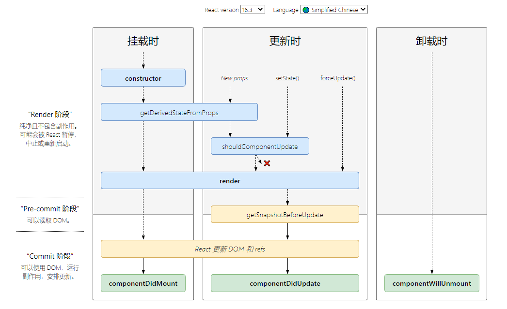

# 生命周期

生命周期分为了三个阶段，分别是挂载阶段、更新阶段、卸载阶段。

React 16之后有三个生命周期被废弃（但未删除）
- componentWillMount
- componentWillReceiveProps
- componentWillUpdate

- 挂载阶段
  - constructor：构造函数
  - getDerivedStateFromProps
  - render
  - componentDidMount
- 更新阶段
  - getDerivedStateFromProps
  - shouldComponentUpdate
  - render
  - getSnapshotBeforeUpdate
  - componentDidUpdate
- 卸载阶段
  - componentWillUnmount

## **ComponentDidUpdate(prevProps, prevState, snapshot)**

&emsp;&emsp;`componentDidUpdate()` 会在更新后被立即调用。**首次渲染不会执行此方法**。

&emsp;&emsp;也可以在 `componentDidUpdate()` 中调用 setState，但需要注意的是得使用条件判断，否则会导致死循环。

&emsp;&emsp;第三个参数 `snapshot` 默认为 undefined，当 `getSnapshotBeforeUpdate` 生命周期的返回值存在时会将其传递给 `componentDidUpdate`。

## **shouldComponentUpdate(nextProps, nextState)**

&emsp;&emsp;根据 `shouldComponentUpdate` 的返回值，判断 React 组件的输出是否受当前 state 或 props 更改的影响。默认情况下 state 发生改变每次都会重新渲染组件。

&emsp;&emsp;当 props 或 state 发生变化时，`shouldComponentUpdate` 会在渲染前被调用，返回值默认为 true。首次渲染或使用 `forceUpdate` 时不会调用该方法。

&emsp;&emsp;手动编写此函数，可以返回 false 告知 React 可以跳过更新，但并不会阻止子组件在 state 更改时重新渲染。

&emsp;&emsp;不建议在这个函数中进行深层比较或使用 JSON.stringfy，非常影响效率和性能。当前，如果此函数返回 false，则不会调用 `UNSAFE_componentWillUpdate()  render()  和 componentDidUpdate()`。

以下是旧版的对比

