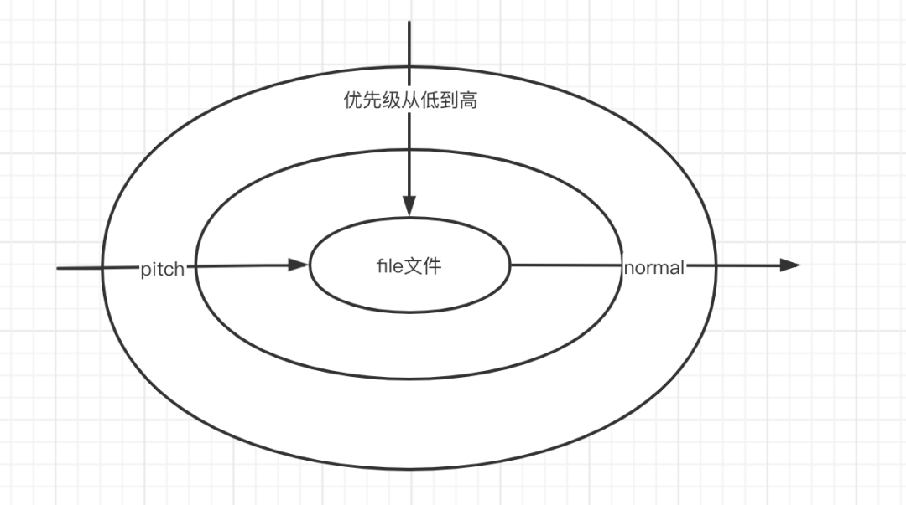
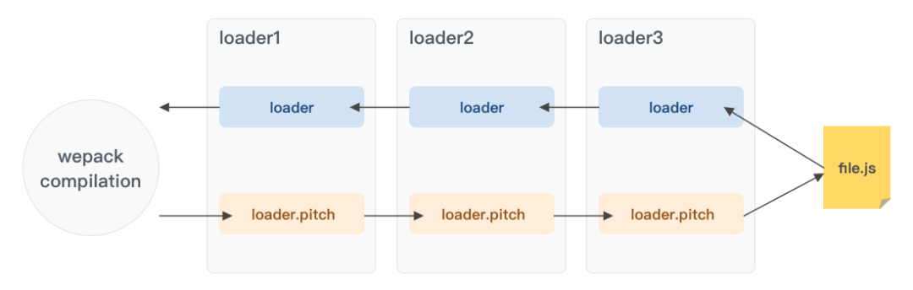

## loader

### 一、什么是 loader？

&emsp;&emsp;webpack 只能理解 JavaScript 和 JSON 文件，这是 webpack 开箱可用的自带能力。

&emsp;&emsp;而 loader 让 webpack 能够去处理其它类型的文件，并将它们转换为有效[模块](https://webpack.docschina.org/concepts/modules)，供应用程序使用，以及被添加到依赖图中。

&emsp;&emsp;loader 本质上是导出为函数的 JavaScript 模块。

&emsp;&emsp;在 webpack 使用过程中，经常会出现以下两种形式，前者更多是我们在 webpack 配置文件中，根据文件匹配信息，去配置 loader 相关信息；后者更多是在 loader/plugin 中去修改、替换、生成的行内 loader 信息。

```javascript
//	webpack.config.js
{
    module: {
        rules: [
            {
                test: /.txt$/,
                use: [
                    {
                        loader: getLoader("a-loader.js"),
                    }
                ],
                enforce: "pre",
            },
            {
                test: /.txt$/,
                use: [
                    {
                        loader: getLoader("b-loader.js"),
                    },
                ],
                enforce: "post",
            },
        ],
    },
}
```

```javascript
//	app.js
import "/Users/caisiqi/Desktop/loader/c-loader.js!./txt.txt"
```

### 二、loader 的分类

&emsp;&emsp;在 webpack 里，loader 可以被分为四类，分别是 `后置post`、`普通normal`、`行内inline`、`前置pre`。

#### enforce

&emsp;&emsp;对于 `post`、`normal`、`pre`，主要取决于在配置里 `Rule.enforce` 的取值：`pre` || `post`，若无设置，则为 `normal`。

**注意**：相对于的是 Rule，并非某个 loader。那么作用于的就是对应 Rule 的所有 loader。

#### inline

&emsp;&emsp;行内 loader 比较特殊，是在 `import/require` 的时候，将 loader 写入代码中。而对于 `inline` 而言，有三种前缀语法：

- `!`：忽略 `normal` loader；
- `-!`：忽略 `pre` 和 `normal` loader；
- `!!`：忽略所有 loader（`pre` `normal` `post`）

&emsp;&emsp;行内 loader 通过 `!` 将资源中的 loader 进行分割，同时支持在 loader 后面，通过 `?` 传递参数，参数信息参考 `loader.options` 内容。

&emsp;&emsp;而以上说的三种前缀语法，则是写在内联 loader 字符串的前缀上，来表示忽略哪些配置 loader。

#### 来几个例子

&emsp;&emsp;以 `a-loader` 为 `pre loader`，`b-loader` 为 `normal loader`，`c-loader` 为 `post loader` 为例。

**本文的 loader 均为**：

```javascript
module.exports = function (content) {
    console.log("x-loader");
    
    return content;
}

module.exports.pitch = function (remainingRequest, precedingRequest, data) {
    console.log("x-loader-pitch");
};
```

- 无前缀信息

```javascript
import "/Users/caisiqi/Desktop/loader/d-loader.js!./txt.txt";

c-loader-pitch
d-loader-pitch
b-loader-pitch
a-loader-pitch
a-loader
b-loader
d-loader
c-loader
```

- ! 前缀信息

```javascript
import "!/Users/caisiqi/Desktop/loader/d-loader.js!/txt.txt";

c-loader-pitch
d-loader-pitch
a-loader-pitch
a-loader
d-loader
c-loader
```

- -! 前缀信息

```javascript
import "-!/Users/caisiqi/Desktop/loader/d-loader.js!./txt.txt";

c-loader-pitch
d-loader-pitch
d-loader
c-loader
```

- !! 前缀信息

```javascript
import "!!/Users/caisiqi/Desktop/loader/d-loader.js!./txt.txt";

d-loader-pitch
d-loader
```

### 三、loader 的优先级

&emsp;&emsp;四种 loader 的调用先后顺序为：`pre` > `normal` > `inline` > `post`。

&emsp;&emsp;在相同种类 loader 的情况下，调用的优先级为自下而上、自右向左（pitch 情况下，反过来）。

```javascript
{
    module: {
        rules: [
            {
                test: /.txt$/,
                use: [
                    {
                        loader: getLoader("a-loader.js"),
                    },
                ],
                enforce: "post",
            },
            {
                test: /.txt$/,
                use: [
                    {
                        loader: getLoader("b-loader.js"),
                    },
                    {
                        loader: getLoader("c-loader.js"),
                    },
                ],
                enforce: "post",
            },
        ],
    },
}
    
a-loader-pitch
b-loader-pitch
c-loader-pitch
c-loader
b-loader
a-loader
```

### 四、loader 调用链

&emsp;&emsp;每个 loader 都有自己的 normal 函数和 pitch 函数，而调用过程则是先根据从低到高的优先级顺序，调用 loader 各自的 pitch 函数，再由高到低调用各自的 normal 函数，其过程，更像是一个洋葱模型。



### 五、loader-pitch

&emsp;&emsp;loader 总是从右到左被调用。有些情况下，loader 只关心 request 后面的元数据（metadata），并且忽略前一个 loader 的结果。在实际（从右到左）执行 loader 之前，会先从左到右调用 loader 上的 pitch 方法。

&emsp;&emsp;对于一个 loader，除了通过 `module.exports` 导出处理函数外，还可以通过 `module.exports.pitch` 导出 `pitch` 方法。正常来说，在 loader 从右向左调用之前，会进行一次从左到右的 `pitch` 方法调用，而在 `pitch` 调用过程中，如果任何一个有返回值，那么将阻断后续的 loader 调用链，进而将自身的返回结果传递给上一个 loader 作为 content。

**补充**：`pitch` 方法同样有同步、异步之分，同样可以选择 `return` 或者 `this.callback` 去传递更多的信息。

&emsp;&emsp;loader 的调用过程：



&emsp;&emsp;而一旦其中的一个 `pitch` 返回了结果，那么将跳过后续的 `loader`，将返回结果传递给前一个 `loader`。


&emsp;&emsp;像常见的 style-loader、vue-loader 等等，就会利用 `pitch` 阶段进行拦截处理工作，从而实现 loader 特色化工作。

### 六、同步、异步 loader

&emsp;&emsp;如果是单个处理结果，可以在同步模式中直接返回。如果有多个处理结果，则必须调用 `this.callback()`。在异步模式中，必须调用 `this.async()` 来告知 loader runner 等待异步结果，它会返回 `this.callback()` 回调函数。随后 loader 必须返回 `undefined` 并且调用该回调函数。

&emsp;&emsp;在 webpack 中，loader 可能会由于依赖于读取外部配置文件、进行网络请求等等原因，从而比较耗时。而此时如果进行同步操作，就会导致 webpack 阻塞住，所以 loader 会有同步、异步之分。

&emsp;&emsp;在 loader 中，可以通过两种方式返回数据：

- return：return 只能返回 content 信息
- callback：

```javascript
this.callback(
	err: Error | null,	//	错误信息
    content: string | Buffer,	//	content信息
    sourceMap?: SourceMap,	//	sourceMap
    meta?: any	//	会被webpack忽略，可以是任何东西（例如：AST、一些元数据之类的）
);
```

**同步loader**：

&emsp;&emsp;对于同步 loader 而言，使用 return 或者 this.callback 均可以达到想要的效果。只不过，相对于 return，this.callback 可以返回更多的信息。

```javascript
module.exports = function(content, map, meta) {
    //	return handleData(content)
    this.callback(null, handleData(content), handleSourceMap(map), meta);
    return ;	//	当调用 callback() 函数时，总是返回 undefined
};
```

**异步loader**：

&emsp;&emsp;对于异步 loader 而言，需要通过 `this.async()` 来获取到 `callback` 函数。

```javascript
module.exports = function(content, map, meta) {
    let callback = this.async();
    
    asyncHandleData(content, function(err, result) {
        if (err) {
            return callback(err);
        }
        callback(null, result, map, meta);
    });
};
```

### 七、loader 的参数

&emsp;&emsp;一般来说，起始 loader 只有一个入参：资源文件的内容。默认情况下，资源文件的内容会以 UTF-8 字符串传递给 loader。而在有需要的情况下，loader 可以通过设置 `module.exports.raw = true` 来表示需要接受一个 `Buffer`。同时，每个 loader 都可以传递 `String || Buffer`，compiler 会将其在 loader 之间根据 `raw` 的值来进行转换。（例如图片文件等）。

&emsp;&emsp;而根据 `callback` 的参数也可以知道，除了起始 loader 之外，loader 可以接受三个参数：`content` `sourceMap` `meta`。

#### loader.pitch 的参数

pitch 一共有三个参数：

- `remainingRequest`：当前 loader 右侧的所有 loader 加上资源路径，根据 `!` 分割，连接而成的内联 loader；
- `precedingRequest`：当前 loader 左侧的所有 loader，根据 `!` 分割，连接而成的内联 loader；
- `data`：在 pitch 阶段和 normal 阶段之间共享的 data 对象。即：pitch 阶段的参数 data 和 normal 阶段通过 this.data 获取的 data 为同一对象。

**补充**：左右侧，相对于 loader 调用链，normal 阶段。

#### example

&emsp;&emsp;例如，有 a、b、c 三个 loader，(use: [a, b, c])在处理某个文件的时候，对应的 a、b、c 各自的 pitch 参数分别为：

- a: `remainingRequest`: b-loader.js!c-loader.js!file.txt; `precedingRequest`:'';
- b: `remainingRequest`: c-loader.js!file.txt; `precedingRequest`: a-loader.js;
- c: `remainingRequest`: file.txt; `precedingRequest`: a-loader.js!b-loader.js;

### 八、loader 的输出

&emsp;&emsp;compiler 预期得到最后一个 loader 产生的处理结果。这个处理结果应该为 `String` 或者 `Buffer` （能够被转换为 string）类型，代表了模块的 JavaScript 源码。另外，还可以传递一个可选的 SourceMap 结果（格式为 JSON 对象）。

&emsp;&emsp;当 loader 链路到了最后一个 loader 时，compiler 期望得到的处理结果是可以转换为 `String` 的 `Buffer` 或者 `String` 类型，表示当前模板处理后的 JavaScript 源码。同时根据 callback 函数可知，还可以传递一个 `sourceMap`。

&emsp;&emsp;除去正常 loader 处理返回的形式输出源码外，还可以根据 `this.emitFile` 来进行额外输出文件。

```javascript
emitFile(
	name: string,
    content: Buffer | string,
    sourceMap?: {...}
);
```

### 九、loader 缓存

&emsp;&emsp;开发环境默认情况下，loader 的处理结果会被标记为可缓存。因为很多 loader 转换的过程是非常耗时的，webpack 默认会将所有 loader 标记为可缓存的，在依赖文件没有改变的情况下是不会重新进行 loader 处理的过程。

&emsp;&emsp;可以通过 `this.cacheable=false` 来标记 loader 为不可缓存，在大部分情况下，还是不推荐将 loader 标记为不可缓存，可以使用 `this.addDependency` 添加文件依赖。

**example**

```javascript
{
    entry: "./app.js",
    mode: "development",
    module: {
        rules: [
            {
                test: /.txt$/,
                use: [
                    {
                        loader: getLoader("a-loader.js"),
                    },
                ],
            },
        ]
    }
}
```

&emsp;&emsp;在 .txt 文件没有发生变化的时候，watch 模式下，重新编译是不会重新调用 a-loader 去重新处理 .txt 文件。如果期望在某个 .js 文件发生变化的时候，重新调用 a-loader 进行处理，就可以使用 this.addDependency 添加文件依赖。

```javascript
module.exports = function(content) {
    console.log("a-loader");
    
    this.addDependency("/Users/caisiqi/Desktop/loader/c.js");
    
    return content;
}
```

**注意**：整个 loader 调用链都会被重新激活。

### 十、loader API

&emsp;&emsp;除了以上提到的一些 API 之外，在 loader 内还可以使用一些其他 API：[The Loader Context](https://webpack.docschina.org/api/loaders/#the-loader-context)

### 十一、loader 开发工具包

1. [loader-runner](https://github.com/webpack/loader-runner)可以通过该包进行 loader 的开发和调试
2. [loader-utils](https://github.com/webpack/loader-utils#readme)集成了 loader 开发中，常用的一些方法，方便开发
3. [schema-utils](https://github.com/webpack/schema-utils)便于验证 loader options 的合法性（包括但不限于 loader 使用）

参考了[这里](https://mp.weixin.qq.com/s/58qVTSB8nPwqcMB-aegNyg)